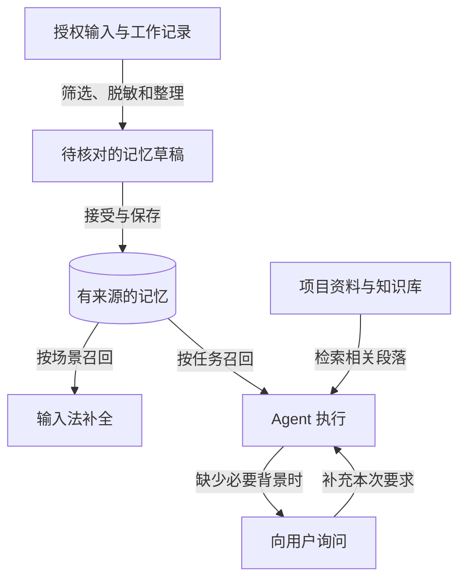
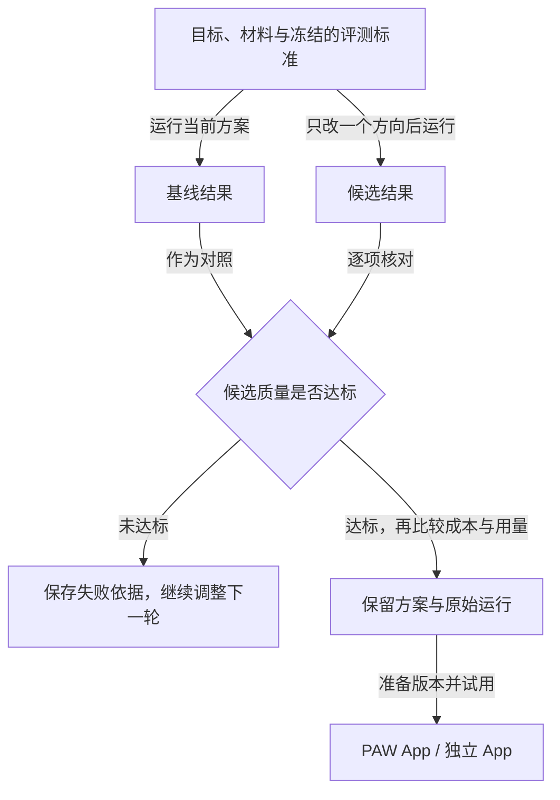
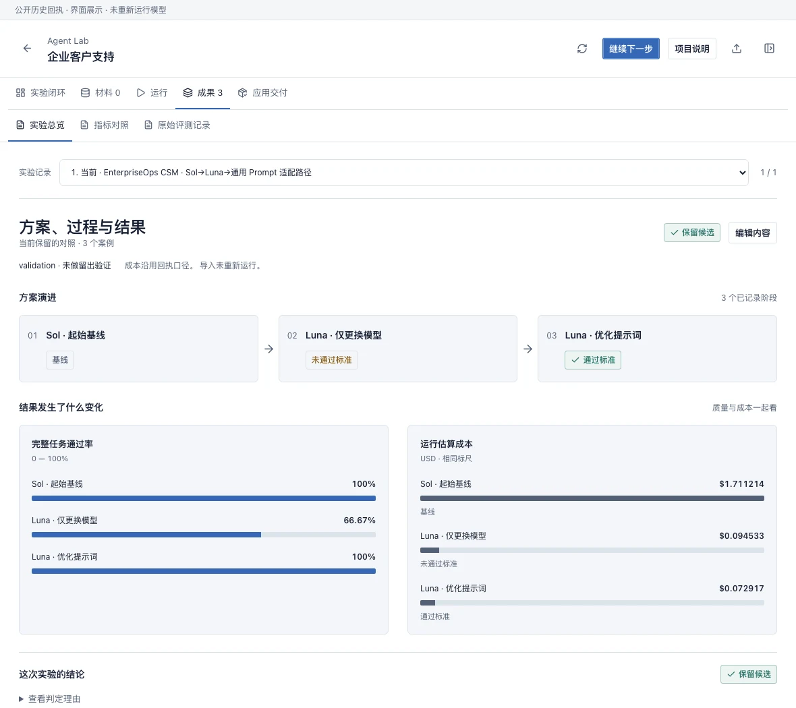
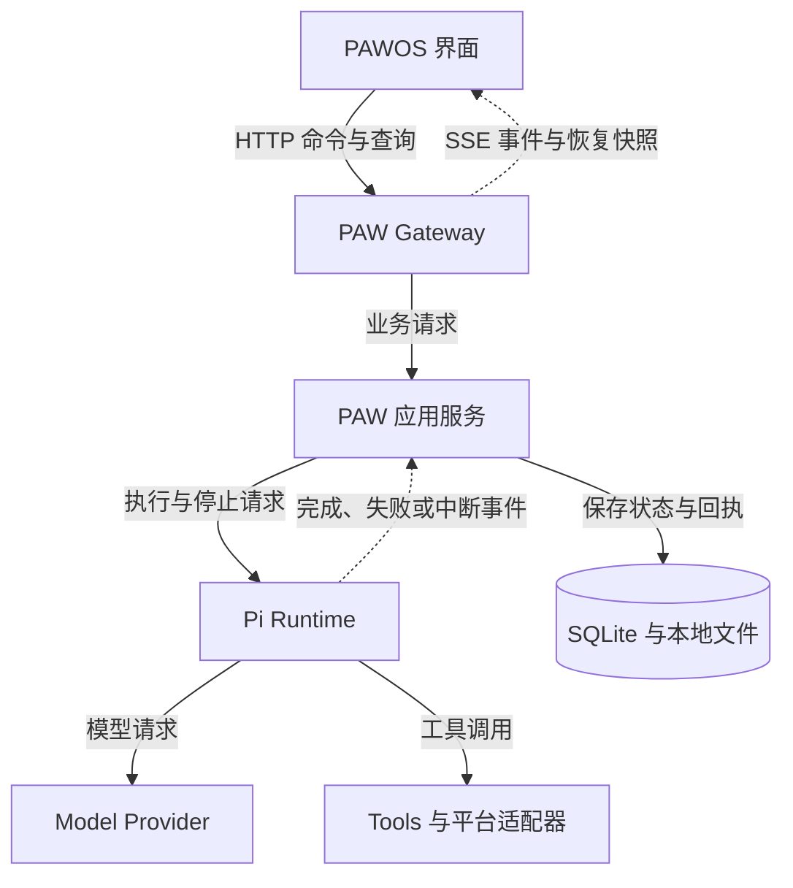

# PAW — Personal Agent Workbench

**少重复解释，让 AI 接着做；先验证效果，再选择成本合适的方案。**

使用 AI 完成一件事，常常要付出两种成本：**把需求讲清楚的沟通成本，以及把任务做完的模型成本。** PAW 从这两个问题出发，把日常上下文、Agent 执行和场景评测放进同一个本地优先的工作台。

- **Memory 减少重复沟通**：在授权范围内整理输入和工作背景，让输入法与 Agent 按需复用。
- **Agent Lab 优化执行方案**：用同一组任务比较模型、提示词、检索和工作流，再把有效的方案交付为 App。

模型可以更换；你的需求、偏好、项目知识和验证过的工作方法可以持续积累。

[为什么做 PAW](#为什么做-paw) · [开始使用](#开始使用) · [上手教程](#上手教程) · [功能](#功能) · [架构](#架构与职责) · [更新记录](CHANGELOG.md) · [下载预览版](https://github.com/7155/personal-agent-workbench/releases)


*桌面截图使用公开演示数据；新版 Lab 配图见下文。[完整图集与采集说明](assets/showcase/current/README.md)。*

## 为什么做 PAW

### 1. 减少沟通成本：已经说过的背景，下次接着用

你在浏览器里填写需求，在文档里记录决策，在其他应用里讨论项目。如果 Agent 只能看到当前对话，你就需要反复补充背景；换一个任务，这个过程又来一次。

PAW 的可选输入法、语音和桌面适配器把**授权范围内的输入**送入记忆整理流程。整理后的内容保留来源，可以核对、修改和撤回。输入法可以据此提供场景补全，Agent 可以按当前任务召回背景；新要求和不确定的信息仍需要补充。

| 继续同一个项目 | 只获得本次对话的 Agent | PAW 已保存并正确召回相关记忆时 |
| --- | --- | --- |
| 其他应用中说过的目标、技术栈 | 再次粘贴或解释 | 复用相关背景 |
| 已表达的输出格式、个人偏好 | 再次说明 | 复用已有偏好 |
| 本次新增的截止时间 | 由你补充 | 由你补充 |
| 示例：5 项必要背景中已有 4 项 | 重新提供 5 项 | 只补充 1 项 |

**5 → 1，相当于少提供 80% 的背景项。** 这是一组解释机制的假设，不是真实追问次数或沟通时间的测量结果。已有的 [6 案例召回微评测](eval/session-recall/session-recall-effect-eval.md)记录了有用命中 **4 → 6**、无关注入 **2 → 0**；它衡量的是召回效果。

### 2. 降低模型成本：在具体任务里验证，找到合适的组合

需求对齐之后，接下来是把事情做好。同一个模型，换一种提示词、检索方式或工具组织方式，结果和成本都可能不同。

Agent Lab 固定任务与通过标准，先运行基线，再比较候选。**质量达标后，才比较成本；失败的便宜方案也会保留在记录中。**

下面是已有的 **EnterpriseOps 客户支持实验**：3 个 Validation 任务，31 项业务终态检查，均使用 `max` 推理强度。

| 方案 | 完整任务通过 | 业务检查通过 | 3 个任务的成本估算 | 判定 |
| --- | ---: | ---: | ---: | --- |
| Sol · 已预加载所需工具定义 | 3/3 | 31/31 | $1.711214 | 基线 |
| Luna · 只替换模型 | 2/3 | 30/31 | $0.094533 | 不保留，质量未达标 |
| Luna · 再明确提示词中的枚举约束 | 3/3 | 31/31 | $0.072917 | 保留这一组合 |

最后一组相对 **Sol 基线**，成本估算降低 **95.74%**，本轮仍为 3/3 任务通过。收益来自模型与提示词的组合变化，不能全部归因于换模型。

<details>
<summary>数据来源与适用范围</summary>

数据对应当前公开记录的三阶段对照：Sol 基线 r8、Luna 仅换模型 r5、Luna 提示词调整 r7。金额使用保存的用量与价格快照计算，并与 Runtime 回执核对；它不是 Provider 账单。题目来自开发过程中使用过的 Validation 集，不能当作新盲测或生产成功率。

[Sol 基线质量](eval/interview-metrics/runs/enterpriseops-csm-sol-max-preloaded-current-runtime-validation-20260904.r8.v1.json) · [Sol 基线成本](eval/interview-metrics/runs/agent-lab-cost-enterpriseops-sol-max-preloaded-current-runtime-20260904.r8.v1.json) · [仅换模型的质量结果](eval/interview-metrics/runs/enterpriseops-csm-luna-preloaded-model-only-validation-20260904.r5.v1.json) · [提示词调整后的质量结果](eval/interview-metrics/runs/enterpriseops-csm-luna-explicit-enum-prompt-validation-20260904.r7.v1.json) · [最终成本回执](eval/interview-metrics/runs/agent-lab-cost-enterpriseops-luna-max-explicit-enum-prompt-20260904.r7.v1.json)

</details>

## 核心工作流

### 背景如何变成下一次工作的上下文



记忆让已知背景可复用；缺失的信息在任务中补齐。输入记录、整理草稿与已接受的记忆分别保存，不把原始输入直接当成长期事实。

### 一个方案如何变成可交付的 App



Agent 围绕同一项目推进材料、运行、结果和交付。每轮改了什么、为什么保留或放弃，都能回到对应的运行记录。[查看指标对照图](assets/showcase/readme/lab-metrics.webp)。



*新版源码界面，使用公开实验元数据展示。图中历史实验没有重新运行，不代表当前模型成绩。[配图来源](assets/showcase/readme/README.md)。*

## 开始使用

### 直接安装 macOS 预览版

1. 打开 [Releases](https://github.com/7155/personal-agent-workbench/releases)，选择所需版本的 `macOS-arm64-unsigned.dmg`，按同页 `SHA256SUMS.txt` 核对文件。
2. 打开 DMG，运行 **Install Personal Agent Workbench**。安装到当前用户的 `~/Applications`。
3. 启动 PAW，在设置中连接模型服务：填写自己的 API Key，或使用该 Provider 支持的 OAuth 登录。
4. 打开 **Agent**，选择一个可用模型，完成下面的第一个教程。

需要 **Apple Silicon、macOS 14+**。离线安装包包含所需运行组件，无需单独安装 Git、Node 或 Python。当前为未经过 Developer ID 签名和 Apple 公证的预览版；macOS 可能要求在“隐私与安全性”中选择“仍要打开”。可选 Squirrel 输入法与本地模型权重单独安装。[完整安装、升级与回滚说明](release/README.md)。

### 先看界面，再决定是否安装

只预览前端，需要 Git、**Node.js 22.19+、pnpm 11.9.0**；无需模型账号：

```bash
git clone https://github.com/7155/personal-agent-workbench.git
cd personal-agent-workbench/control-center-web
corepack enable
corepack prepare pnpm@11.9.0 --activate
pnpm install --frozen-lockfile
pnpm dev
```

在开发服务器显示的地址后添加 `/?frontend=paw-os&controlTransport=mock`。这是公开演示模式，可以查看界面；真实模型调用、本机文件读取和完整原生 Browser 需要实际运行环境。开发后端与 Gateway 的步骤见 [CONTRIBUTING.md](CONTRIBUTING.md) 和 [源码构建指南](release/README.md#source-build-requirements)。

## 上手教程

以下真实执行教程适用于已连接 Runtime 和模型的安装版。输入法与自动采集都不是开始使用的前提。

### 教程一：完成一次对话，再接着修改

1. 打开 **Agent**，选择可用模型，发送：

   ```text
   把下面的安排整理成待办清单，保留时间，不补充未提供的信息：
   周三上午整理产品反馈，周四下午和同事核对，下周一提交总结。
   ```

2. 回答完成后，在同一个对话继续输入：“改成表格，增加一列待确认事项。”
3. 展开本轮执行记录，核对所用模型、完成状态和实际返回的内容。

**完成标志**：后续修改沿用同一任务背景，原始回答和执行记录仍可查看。

想体验记忆时，先在 **Memory** 核对已有记忆及来源，再打开对话栏的记忆选项。在本轮记忆记录中查看实际召回的内容；没有召回时，补充背景或调整记忆，不把“已开启”当成“已理解”。

### 教程二：让回答带着资料来源

把下面内容保存为 `support-demo.md`。这是教程用的虚构业务说明，不含个人资料：

```markdown
# 示例售后说明
- 普通商品在签收后 7 天内可以申请退货。
- 人工客服会在 1 个工作日内首次回复工单。
- 因商品质量问题退货，商家承担退货运费。
- 退款到账时间未在本说明中约定，需要客服进一步确认。
```

1. 打开 **Knowledge**，创建一个用于练习的知识库，导入这个文件，等解析和索引完成。
2. 先搜索“退货运费”，检查命中段落是否来自该文件。
3. 在 Agent 中要求：“查询这个知识库，说明退货期限和运费规则，并标明来源；资料没写的内容请明确说明。”

**完成标志**：回答能回到导入文件中的对应段落。再问“退款几天到账”，应得到资料未约定的说明，而不是猜测一个天数。


### 教程三：在 Lab 比较方案，导出自己的 App

使用同一份 `support-demo.md`：

1. 打开 **Agent Lab → 新建项目**，添加文件，并写下目标：

   ```text
   做一个基于这份售后说明的问答 App。
   回答必须有资料依据；资料未约定的内容要说明未知。
   先起草 4 道小型评测题及通过标准，区分开发题和留出题供我核对。
   使用已配置的模型，本轮只比较一组基线和候选；保留失败与实际用量。
   完成后把结果做成可视化，并准备可试用、可导出的 App。
   ```

2. 在项目对话中核对题目与通过标准。缺少材料或模型配置时补齐，沿用当前项目继续。
3. 在 **运行** 中查看基线与候选的真实状态；在 **成果** 中查看改动、逐项指标和原始运行引用。
4. 在 **应用交付** 试用准备好的版本。满意后选择 **添加至 PAW**，或 **下载独立 App**。
5. 解压独立包，按包内 README 配置模型并启动。文本生成 App 的基本命令为 `python3 app.py`；知识库、工具与外部工作台的依赖以所导出版本的说明为准。

**完成标志**：有可核对的运行结果，也有能实际输入并获得回答的 App。候选没超过基线、金额未回报、运行失败，都应该如实显示；不需要为了“优化成功”改写成绩。

> **版本提示**：`main` 的 Lab 已包含新版项目与成果界面。Release 只包含对应标签的代码；若安装包界面与本文不同，先查看版本和 [CHANGELOG](CHANGELOG.md)。导入已有实验只复制历史记录，复跑需要当前材料和执行环境。

## 功能

| 你要做的事 | 使用什么 | 可以看到什么 |
| --- | --- | --- |
| 持续完成一项工作 | **Agent** | 对话、附件、工具、分支、停止与恢复 |
| 任务需要分工 | **Room** | 主任务、伙伴进展和交付；每个伙伴使用自己的 Pi Session |
| 复用偏好与决策 | **Memory** | 记忆正文、来源、使用记录、版本与撤回 |
| 查阅文档 | **Knowledge** | 导入、解析、检索、引用与原文位置 |
| 找出为什么失败 | **Trace** | 模型请求、工具调用、上下文与执行状态 |
| 比较并交付方案 | **Agent Lab** | 基线、候选、失败、指标、版本与 App |
| 管理扩展能力 | **App Center** | Tools、Skills、Packages、扩展 App 及安装状态 |
| 操作本机工作环境 | **Files / Browser / Terminal** | 文件预览、完整浏览器与终端；Files 读取不要求 Session |
| 配置输入与系统 | **Input Studio / System Settings** | 可选输入法、语音、模型服务和外观设置 |

简单任务使用一个 Session；需要分工时再展开 Room。[查看完整功能图集](assets/showcase/current/README.md)。

## 常见问题

| 遇到的情况 | 下一步 |
| --- | --- |
| 页面有示例数据，却不能执行真实任务 | 检查是否用了 `controlTransport=mock`；切换到安装版或已连接的真实 Gateway。 |
| 模型不可用、未登录或额度不足 | 在设置中核对所选 Provider 与模型。界面连通不等于模型账号可调用。 |
| 历史项目提示“准备复跑” | 补充当前材料和执行条件；已有结果仍可查看。 |
| 文件不在任何 Session 中 | 在 Files 地址栏直接打开本机文件夹或外部磁盘路径；保存修改仍遵循工作区权限。 |
| 独立 App 能打开，却无法生成回答 | 按包内 README 配置模型服务，或连接持有该版本的本机 PAW；模型凭据不随包导出。 |
| 后端更新了，界面仍是旧版 | 使用整套安装流程更新，核对版本后重新打开 PAW。[更新与回滚](release/README.md#local-installation)。 |

## 隐私与权限

- **采集可选、范围明确**：输入、语音、浏览器和桌面能力由对应适配器与设置控制。对话记忆默认关闭。
- **内容可核对、可撤回**：原始记录、整理草稿和已接受事实分开保存，记忆与检索保留来源。
- **本地优先**：被动输入预测保持本地运行；显式 Agent、语音和 Knowledge 工作流按配置调用服务。
- **权限由执行方落实**：Session、Room、工具和 Provider 使用各自的资源配置。Rime 继续负责拼音解析与原生候选，AI 补全保持独立标识。

[Memory 生命周期](rag_ime/memory_lifecycle/README.md) · [安全问题反馈](SECURITY.md)。

## 架构与职责

Pi 负责 Session、模型与工具执行；PAW 负责工作空间、协作、记忆、评测与交付。界面通过命令、事件和快照恢复当前状态。



执行成功、失败和中断都回到同一套状态记录；窗口关闭与任务停止分别处理。

| 层 | 源码入口 |
| --- | --- |
| 产品装配与扩展宿主 | [src/app](control-center-web/src/app/) |
| PAWOS 桌面与窗口 | [src/paw-os](control-center-web/src/paw-os/) |
| 各功能页面 | [src/features](control-center-web/src/features/) |
| Gateway 与应用服务 | [rag_ime](rag_ime/) |
| Pi 集成与资源 | [integrations/pi](integrations/pi/) |
| 生命周期与持久化 | [rag_ime/db](rag_ime/db/) · [Runtime 合约](integrations/pi/session-runtime-host-contract.json) |

扩展页面通过 `registerProductExtensionHosts()` 装配，OS 按宿主类型加载页面。职责边界由 [check_owner_boundaries.py](scripts/check_owner_boundaries.py) 检查。

## 开发与文档

[CONTRIBUTING.md](CONTRIBUTING.md) 包含环境、测试与贡献流程；[release/README.md](release/README.md) 包含源码构建、安装、升级和回滚。源码开发需要 Python 3.12+、uv，以及前端要求的 Node / pnpm；完整 Agent 执行还需要符合合约的 managed Pi Runtime。

| 文档 | 用途 |
| --- | --- |
| [本地运维](release/operations.md) | 对话导入、旧记忆迁移、多设备 Gateway |
| [功能图集](assets/showcase/current/README.md) | 各 App 的截图与范围说明 |
| [eval](eval/) · [examples/lab](examples/lab/README.md) | 实验回执与可运行的离线 Lab 示例 |
| [tests](tests/) · [scripts](scripts/) | 回归、构建与维护 |
| [AGENTS.md](AGENTS.md) | 仓库协作规范 |

## 许可与致谢

项目自有源码采用 [GPL-3.0-only](LICENSE)，Copyright © 2026 7155。第三方组件、模型和服务保留各自许可，详见 [THIRD_PARTY_NOTICES.md](THIRD_PARTY_NOTICES.md)。

感谢 Pi、Electron、React、Squirrel/librime 及相关开源项目。PAWOS 界面参考 React OS，详见[来源说明](control-center-web/docs/references/README.md)。
