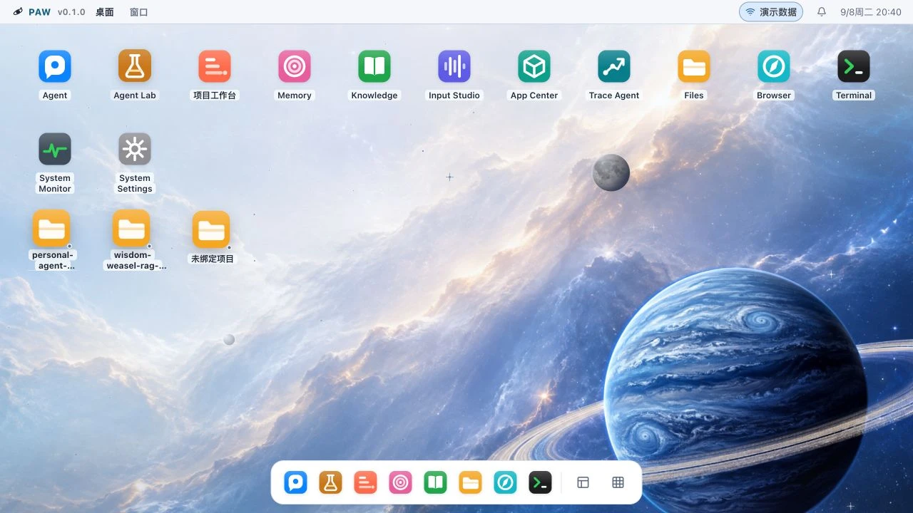
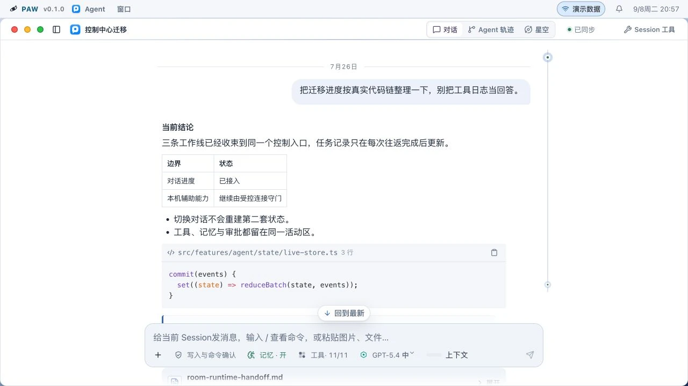
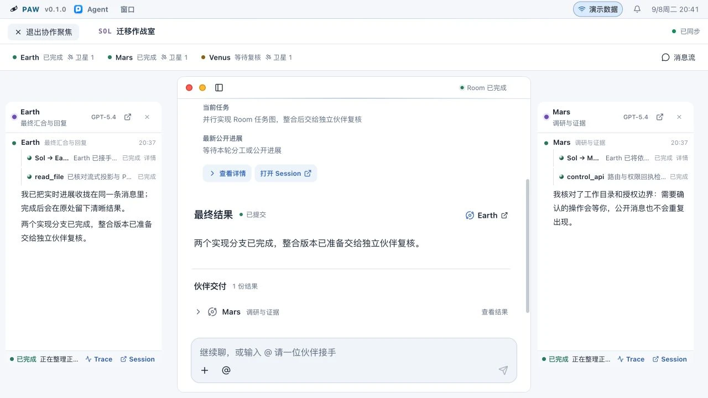
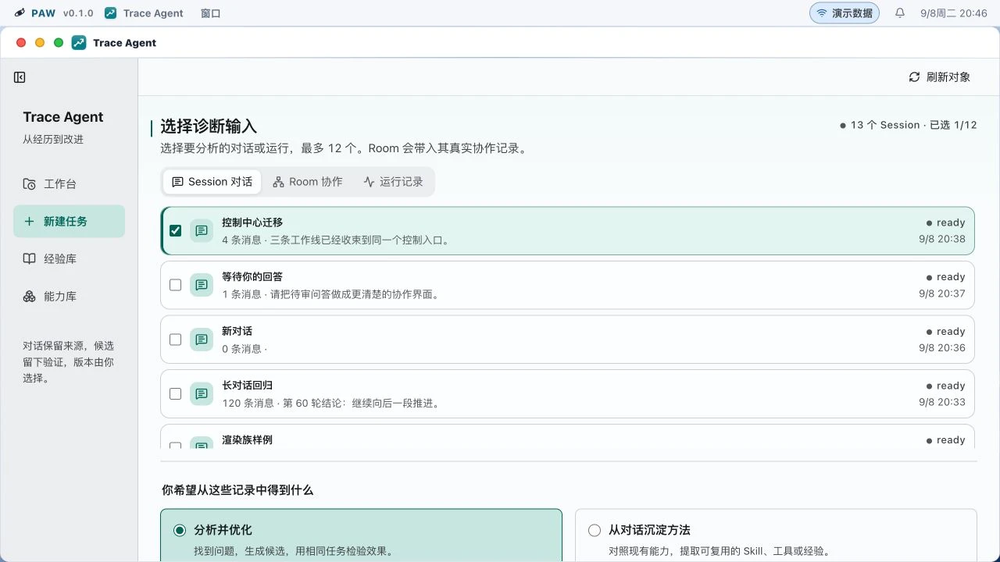
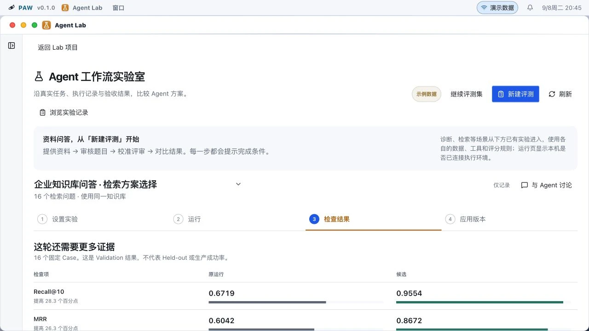
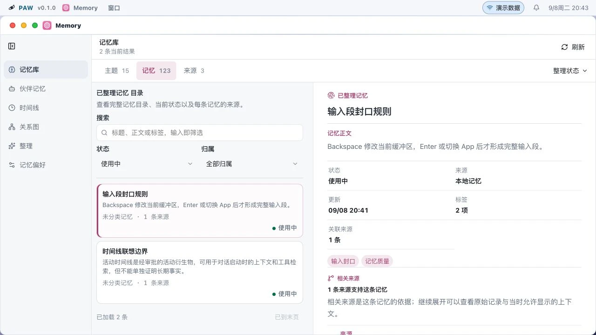
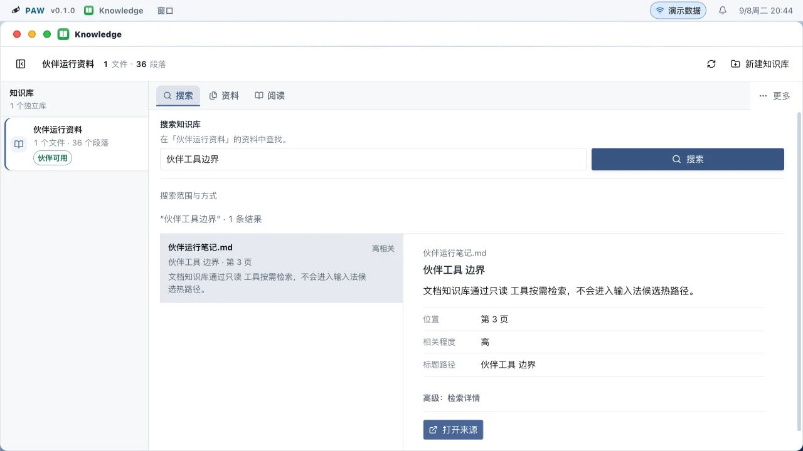
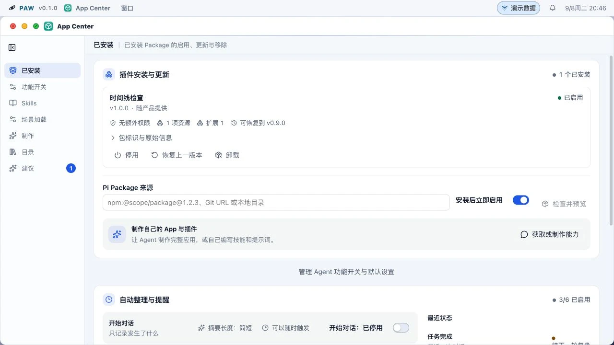
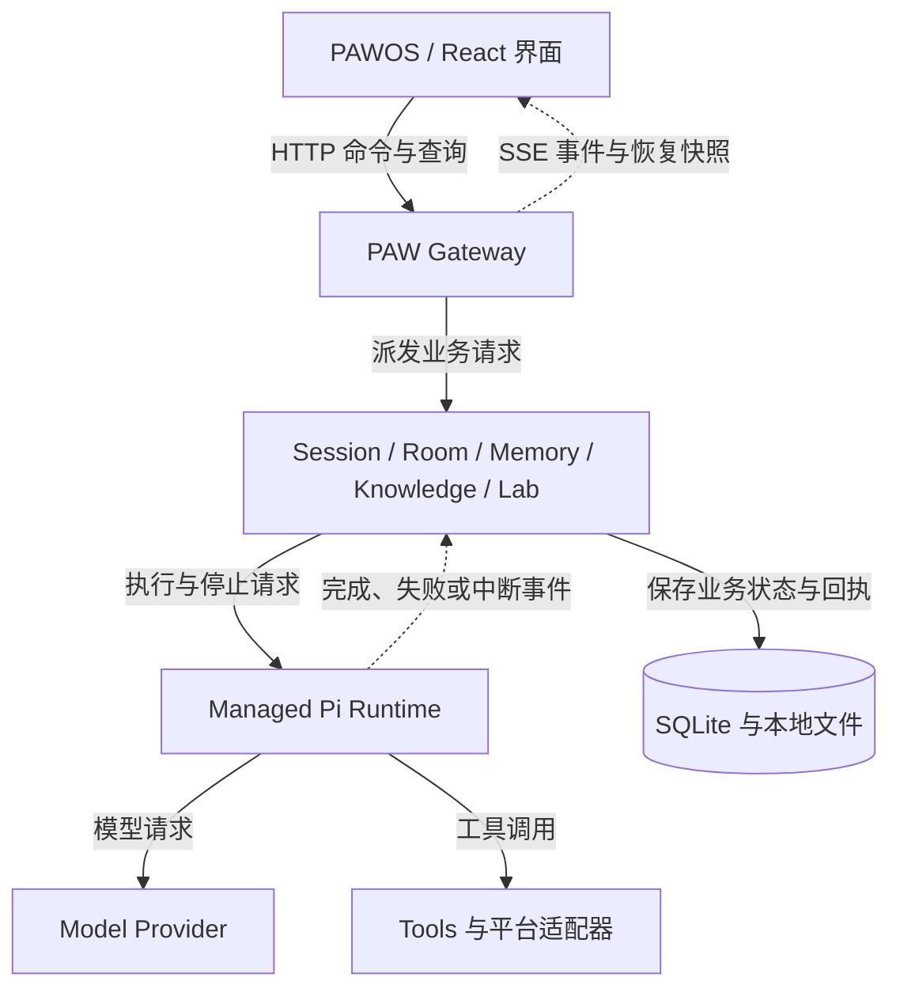

# PAW — Personal Agent Workbench

一个本地优先的 Agent 工作台：用持续对话完成任务，按需组织多 Agent 协作，
从执行记录中发现问题，通过测评改进方案，再把能力交付为可使用的应用。

**macOS 14+ · Python 3.12+ · Node.js 22.19+ · [GPL-3.0-only](LICENSE)**

[功能介绍](#功能介绍) · [界面图集](assets/showcase/current/README.md) ·
[开始使用](#开始使用) · [架构](#架构与职责) ·
[构建与安装](release/README.md) · [更新记录](CHANGELOG.md) ·
[Releases](https://github.com/7155/personal-agent-workbench/releases)

PAWOS 前端参考 React OS，把对话、项目、协作、记忆、知识库和 Agent Lab
放在同一个桌面工作空间。Pi 负责底层 Session、模型与工具执行；PAW 组织应用、
数据和交互，让每一次工作能够继续、检查和改进。



当前提供源码预览版，面向本地开发和自托管体验。macOS 桌面宿主为 Electron；
正式安装包的签名、公证与完整前台验收状态见
[发布说明](release/README.md#source-publication-and-binary-release)。

> 本页图片采集自当前源码的公开演示数据，不含个人 Session 或凭据。
> 演示中的运行状态和指标用于说明界面，不代表实时模型执行、性能结论或 macOS 前台验收。
> [查看全部 17 张截图及采集范围](assets/showcase/current/README.md)。

## 功能介绍

### Agent：持续对话与工具执行

围绕一个任务选择模型、推理强度和工作目录，在同一个 Session 中读取文件、运行命令、
调用工具并查看结果。对话支持附件、消息分支、执行中补充指令、停止以及中断后的恢复。
Pi 管理 Session 的模型与工具循环，界面展示对应的执行状态。

[上下文轨迹](assets/showcase/current/pawos-agent-trace.webp)按轮次呈现输入、角色、
工具、记忆召回和模型请求，帮助定位缺少的信息、重复上下文以及失败的工具调用。
正文、代码、文件和运行细节可以在同一工作空间中阅读。



### Room：按需展开多 Agent 协作

简单任务可以由一个 Session 完成。需要分工时，主 Agent 可以调用私有 Tool Agent，
也可以在 Room 中派发给具有明确职责的 Partner Session。Facilitator 接收各方结果并汇总；
每个参与者仍使用自己的 Pi Session。

主对话保留整体任务与最终结果，伙伴窗口展示各自的公开进展、工具和交付。
可以查看消息流、协作关系及原始 Session；关闭视图与停止执行是不同的操作。



### Trace Agent：从执行记录定位改进点

选择一个或多个 Session、Room 或运行记录，确定分析目标，以及需要关注的工具、
Skill、提示词、流程和模型。诊断页面将原始对话、行动顺序与 Trace 放在一起，
保留返回原 Session、Trace 和工作区文件的入口。

工作台组织诊断任务、候选改动、重测结果和版本决策；经验库与能力库用于延续可复用的方法。
报告中的分析、验证结果和已应用版本分别记录，不能将一份建议当作已经生效的修复。



### Agent Lab：评测、比较与应用交付

以任务和业务材料建立项目，整理案例与预期结果，执行基线，再比较模型、提示词、工具、
Skill、检索和工作流程的候选方案。项目可以组织文档、表格、表单、代码和 HTML 等成果，
通过 Agent 对话继续修改和验证。

实验页面保留变量变化、案例结果、执行轨迹、用量及成本估算。先判断任务质量，
再比较成本；耗时单独记录。开发集、Validation、Held-out 和生产结果保留各自的适用范围。

通过验证的成果可以准备为 PAW App，或导出独立运行的应用。交付会绑定所选版本、文件与配置；
独立运行所需的 Provider、工具及知识库能力由导出配置决定。



### Memory：可追溯的长期记忆

管理个人偏好、长期事实和项目知识，在主题、已整理记忆与原始来源之间逐层查看。
每条记忆保留状态、标签、关联来源和被 Session 使用的记录；整理草稿、直接编辑、
版本、归档与回滚让长期内容能够持续维护。

Memory 面向个人与项目的长期上下文。活动记录、待确认草稿和已接受事实分别保存，
Agent 按任务需要召回相应内容。



### Knowledge：资料导入、检索与引用

按知识库管理外部资料，完成文档导入、解析、分块和索引。搜索结果显示命中的段落、
标题路径与来源位置，并可返回原文核对。解析可以按配置接入本地 MinerU 等组件。

Knowledge 与 Memory 分别维护自己的数据和检索边界。Agent 通过工具按需查询文档库，
检索结果保留来源，便于检查回答依据。



### App Center：Tools、Skills、Packages 与扩展 App

Tools 提供可执行能力，Skills 提供按任务加载的方法，Pi Packages 承载可复用资源。
App Center 提供安装预览、启用、停用、更新、版本恢复和卸载入口。

源码内 React App 随产品构建；Lab 产物通过服务端激活清单提供应用身份，再由注册的页面宿主加载。
宿主注册只决定如何打开页面，安装状态仍来自应用清单。运行中的 Session 保留自己的资源快照。



### 项目与桌面工具

PAWOS 提供窗口、Dock、应用启动器、项目导航与独立结果窗口。
以下工具与主对话共享工作空间，具体能力取决于已连接的 Runtime 和桌面适配器。

| 功能 | 可以做什么 | 界面 |
| --- | --- | --- |
| 项目工作台 | 查看项目概览、任务和工作文档，从最近项目继续工作 | [项目概览](assets/showcase/current/pawos-project.webp) |
| Files | 浏览 Session 授权的工作区，预览代码、Markdown、diff、SVG 和网页 | [文件与预览](assets/showcase/current/pawos-files.webp) |
| Browser | 在 PAW 内组织网页标签与 Agent 浏览器操作；完整历史、书签和下载由桌面宿主提供 | [网页控制视图](assets/showcase/current/pawos-browser.webp) |
| Terminal | 使用与工作目录关联的终端，查看输出、搜索记录并管理终端会话 | [内置终端](assets/showcase/current/pawos-terminal.webp) |
| Input Studio | 配置可选的 Squirrel/Rime 输入、词库、语音与输入记录 | [输入设置](assets/showcase/current/pawos-input.webp) |
| System Monitor | 按时间线查看事件、耗时、关联 Trace、上下文和问题诊断 | [运行记录](assets/showcase/current/pawos-monitor.webp) |
| System Settings | 管理模型服务、外观、Agent 配置与治理设置 | [系统外观](assets/showcase/current/pawos-settings.webp) |

启用输入适配器时，拼音解析、原生候选和用户词库由 Rime 管理，AI 候选保持独立标识。
被动输入预测保持本地运行；显式 Agent、语音或知识处理工作流按所选配置使用相应服务。

## 开始使用

### 查看前端

需要 Git、Python 3.12+、uv、Node.js 22.19+ 和 pnpm 11.9.0。
克隆源码并安装锁定依赖：

```bash
git clone https://github.com/7155/personal-agent-workbench.git
cd personal-agent-workbench
uv sync --locked
corepack enable
corepack prepare pnpm@11.9.0 --activate
pnpm --dir control-center-web install --frozen-lockfile
pnpm --dir control-center-web dev
```

开发服务器会显示访问地址。在地址后加上
`/?frontend=paw-os&controlTransport=mock` 可打开本文的 PAWOS 演示界面。
真实 Agent 调用需要下面的 Gateway 和匹配的 managed Pi Runtime。

### 运行本地服务

```bash
uv run --locked python -m rag_ime.cli init-db

# 构建连接真实 Gateway 的前端。
RAG_IME_CONTROL_TRANSPORT=http \
RAG_IME_CONTROL_BUILD_CHANNEL=production \
  scripts/build_control_center_web.sh

uv run --locked python -m rag_ime.cli agent-gateway \
  --host 127.0.0.1 --port 8768 \
  --web-dist control-center-web/dist
```

随后访问 `http://127.0.0.1:8768`。Agent 执行需要安装与
[Runtime 合约](integrations/pi/session-runtime-host-contract.json)兼容的 Pi，
并在设置中配置 Provider 的 API Key 或受支持的 OAuth 登录。
安装顺序、Pi 源码要求和 macOS 桌面构建见 [构建与安装](release/README.md)。

已有安装应使用整套安装脚本更新组件，避免前后端和 Runtime 版本不同步。
数据库、认证信息、模型权重和插件业务资料由用户本地管理。

## 架构与职责

PAW 的 Python 业务按模块组织，经 Gateway 向界面提供接口。
Pi Runtime 管理执行循环；Room、Memory、Knowledge、Trace 和 Lab 分别保留自己的职责与数据。
界面从 HTTP/SSE 接收状态，窗口布局只保存展示信息。



PAW 管理业务与持久记录，Pi 管理模型和工具执行；界面通过事件和快照恢复已有状态。

| 层 | 主要职责 | 源码入口 |
| --- | --- | --- |
| 产品装配 | 启动界面，注册具体扩展页面宿主 | [src/app](control-center-web/src/app/) |
| PAWOS | 桌面、窗口、扩展清单与页面加载 | [src/paw-os](control-center-web/src/paw-os/) |
| 功能页面 | Agent、Memory、Knowledge、Lab、Trace 等交互 | [src/features](control-center-web/src/features/) |
| Gateway / 应用服务 | API、持久化事件、Room 协作与能力配置 | [rag_ime](rag_ime/) |
| HTTP 适配 | 请求参数、合约与错误响应 | [路由表](rag_ime/control_api/route_table.py) · [Lab 错误映射](rag_ime/control_api/lab_errors.py) |
| Pi 接入 | Session、模型/工具循环、压缩、停止与恢复 | [Pi 适配器](rag_ime/pi_runtime_v2.py) · [历史纯投影](rag_ime/pi_runtime_transcript.py) · [Pi 契约](integrations/pi/) |
| Agent Lab | 项目接入、Trial、场景适配、比较与应用交付 | [模块说明](rag_ime/agent_lab/README.md) |
| 数据与平台 | 数据库、浏览器、桌面、语音与输入适配 | [db](rag_ime/db/) · [integrations](integrations/) · [squirrel-patches](squirrel-patches/) |

扩展页面采用产品装配：`registerProductExtensionHosts()` 绑定 `lab-html` 的惰性加载器，
OS 注册表通过宿主类型加载页面，不直接导入 `LabAppHost`。
App 激活、manifest/hash 校验和布局恢复继续使用原有路径；注册宿主不会安装 App。

依赖约束由 [check_owner_boundaries.py](scripts/check_owner_boundaries.py) 检查并接入 CI：
Lab 不得依赖 `AgentService`、HTTP 或 CLI 入口；Knowledge 不得反向依赖 Lab；
数据库模块不得反向依赖这些业务层。检查包括函数内和条件导入，以及可静态识别的动态导入，
并与已有导入、Pi 家族和路由归属检查共同使用。

## 开发与验证

从 [CONTRIBUTING.md](CONTRIBUTING.md) 配置开发环境，按功能定位源码和测试。
使用 Agent 开发时，仓库约定见 [AGENTS.md](AGENTS.md)。

```bash
uv run --locked python scripts/check_project_harness.py
uv run --locked python scripts/check_owner_boundaries.py
uv run --locked python scripts/check_import_boundaries.py
uv run --locked python scripts/check_route_ownership.py
uv run --locked python -m unittest discover -s tests
pnpm --dir control-center-web typecheck
pnpm --dir control-center-web test
pnpm --dir control-center-web build
```

[CONTRIBUTING.md](CONTRIBUTING.md) 包含完整检查要求。
输入、语音和桌面行为还需在真实前台应用中验证。

| 文档或目录 | 用途 |
| --- | --- |
| [release](release/README.md) | 依赖、构建、安装、升级、回滚及发布 |
| [本地运维](release/operations.md) | 对话导入、旧记忆迁移及多设备 Gateway |
| [架构与职责](#架构与职责) | 后端模块、PAWOS 前端与工具的代码归属 |
| [control-center-web](control-center-web/) | PAWOS 前端源码 |
| [功能图集](assets/showcase/current/README.md) | 各 App 的界面、用途与截图说明 |
| [eval](eval/) | 测评案例、实验方法和结果记录 |
| [tests](tests/) · [scripts](scripts/) | 回归检查、构建与维护工具 |
| [SECURITY.md](SECURITY.md) | 漏洞报告与敏感数据处理 |

## 许可与致谢

项目自有源码采用 [GPL-3.0-only](LICENSE)，Copyright © 2026 7155。
第三方组件、模型和服务保留各自许可，详见
[THIRD_PARTY_NOTICES.md](THIRD_PARTY_NOTICES.md)。

感谢 Pi、Electron、React、Squirrel/librime 及相关开源项目。
Wisdom-Weasel、Yuxi、VCPToolBox 等项目为工作流研究提供了参考。
PAWOS 前端的界面设计参考了 React OS，详见[来源说明](control-center-web/docs/references/README.md)，
具体来源与许可边界以第三方声明为准。
