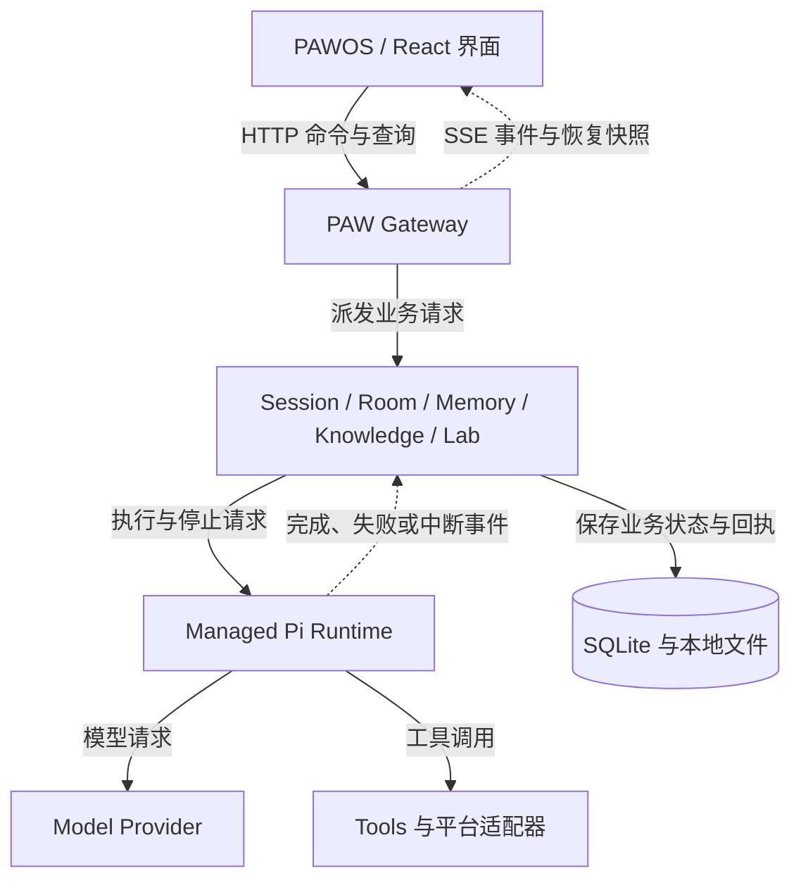

# PAW — Personal Agent Workbench

PAW 是一个本地优先的 Agent 工作台。

它从两个问题出发：

- **Agent 如何持续理解一个人？** 人的工作会跨 Session、跨项目、跨应用和跨时间延续。PAW 将对话、项目、授权范围内的工作信号、Memory 与 Knowledge 组织成可继续、可检查、可回滚的上下文。
- **如何为具体任务找到合适的 Agent 配置？** Agent 的效果由 Model、Prompt、Context、Tool、Skill、Harness 和 Workflow 共同决定。PAW Lab 用固定任务集比较这些变量，在满足质量要求后再权衡成本、延迟和稳定性。

Pi 负责底层 Session、模型和工具执行；PAW 负责工作空间、业务状态、协作、记忆、评测、权限边界和结果交付。PAWOS 把这些能力放进一个桌面工作空间，让一次工作能够继续，让一次失败能够解释，让一次改进能够重测。

**macOS 14+ · Python 3.12+ · Node.js 22.19+ · [GPL-3.0-only](LICENSE)**

[核心工作流](#核心工作流) · [功能](#功能) · [隐私与权限](#隐私与权限) ·
[架构](#架构与职责) · [开始使用](#开始使用) · [构建与安装](release/README.md) ·
[更新记录](CHANGELOG.md) · [Memory 生命周期](rag_ime/memory_lifecycle/README.md) ·
[Releases](https://github.com/7155/personal-agent-workbench/releases)


PAWOS 前端参考 React OS，将 Agent、项目、协作、Memory、Knowledge 和 Agent Lab 放在同一个桌面工作空间。

当前仓库同时提供源码预览版和 Apple Silicon macOS 离线安装预览版。安装器包含桌面端、听写组件、Python 和 Pi Runtime，无需另装开发工具；请从 Release 下载 `.dmg`。安装预览版尚未获得 Developer ID 签名或 Apple 公证，签名、公证、安装和前台验收状态见[发布说明](release/README.md#source-publication-and-binary-release)。

> 本页截图来自当前源码的公开演示数据，不含个人 Session 或凭据。截图中的运行状态和指标用于说明界面，不代表实时模型执行、性能结论或 macOS 前台验收。
> [查看 17 张截图及采集范围](assets/showcase/current/README.md)。

## 核心工作流

PAW 把 Agent 工作拆成一条可以反复运行的链路：

```text
继续工作 → 组织协作 → 记录执行 → 定位问题 → 评测候选 → 交付应用
   ↑                                                   ↓
   └──────────── Memory / Knowledge / 项目上下文 ────────┘
```

1. **继续工作**：在一个 Session 中对话、读写工作区、运行命令、调用工具，并从中断处恢复。
2. **组织协作**：任务需要分工时，再展开 Room，让多个独立 Pi Session 各自承担明确职责。
3. **记录执行**：Trace 保存输入、模型请求、工具调用、记忆召回、状态变化和结果。
4. **定位问题**：从真实执行记录中区分缺少上下文、工具失败、流程问题和配置问题。
5. **评测候选**：在 Agent Lab 中固定案例和预期结果，比较 Model、Prompt、Tool、Skill、检索和 Workflow。
6. **交付应用**：把经过验证的成果绑定到版本、文件和配置，准备为 PAW App 或导出为独立应用。

## 功能

### Agent：持续对话与工具执行

围绕一个任务选择模型、推理强度和工作目录，在同一个 Session 中读取文件、运行命令、调用工具和查看结果。支持附件、消息分支、执行中补充指令、停止以及中断后的恢复。Pi 管理模型与工具循环，PAW 展示执行状态和持久回执。

[上下文轨迹](assets/showcase/current/pawos-agent-trace.webp)按轮次呈现输入、角色、工具、Memory 召回和模型请求。正文、代码、文件和运行细节可以在同一工作空间中阅读。


### Room：按需展开多 Agent 协作

简单任务保持单 Session。需要分工时，主 Agent 可以调用私有 Tool Agent，也可以在 Room 中派发给具有明确职责的 Partner Session。Facilitator 接收各方交付并汇总；每个参与者仍使用自己的 Pi Session。

主对话保留整体任务和最终结果，伙伴窗口展示各自的公开进展、工具和交付。协作窗口可以收起，后台工具仍会继续运行；关闭视图和停止执行是两个不同动作。


### Memory：可追溯的长期上下文

Memory 管理个人偏好、长期事实和项目决策。每条记忆保留状态、标签、关联来源和被 Session 使用的记录；整理草稿、直接编辑、版本、归档和回滚让长期内容能够持续维护。

活动记录、待确认草稿和已接受事实分开保存。对话记忆默认关闭，可在输入栏开启；Room 中可以分别调整伙伴的 Memory、插件、Skill 和 Tool。设置从下一轮生效，已有内容不会被隐式改写。


### Knowledge：资料导入、检索与引用

Knowledge 管理外部资料，覆盖导入、解析、分块、索引和检索。搜索结果显示命中段落、标题路径和来源位置，并可返回原文核对；解析可以按配置接入本地 MinerU 等组件。

Knowledge 与 Memory 保持独立的数据和检索边界。Agent 通过工具按需查询文档库，检索结果保留来源，便于检查回答依据。


### Trace：从执行记录定位改进点

Trace 将原始对话、行动顺序、工具调用和执行状态放在一起。可以选择一个或多个 Session、Room 或运行记录，指定需要关注的 Model、Prompt、Tool、Skill、流程和上下文。

诊断任务、候选改动、重测结果和版本决策分别记录。报告中的分析、验证结果和已应用版本有清晰边界，建议本身不会被当作已经生效的修复。


### Agent Lab：评测、比较与应用交付

以任务和业务材料建立项目，整理案例与预期结果，先执行基线，再比较 Model、Prompt、Tool、Skill、检索和 Workflow 候选方案。

实验记录变量变化、案例结果、执行轨迹、用量和成本估算。开发集、Validation、Held-out 和生产结果保留各自的适用范围；质量先于成本，耗时单独记录为诊断信号。

通过验证的成果可以准备为 PAW App，或导出为独立运行的应用。交付会绑定所选版本、文件和配置；独立运行所需的 Provider、Tool 与 Knowledge 能力由导出配置决定。


### App Center：Tools、Skills、Packages 与扩展 App

Tools 提供可执行能力，Skills 提供按任务加载的方法，Pi Packages 承载可复用资源。App Center 提供安装预览、启用、停用、更新、版本恢复和卸载入口。

源码内 React App 随产品构建；Lab 产物通过服务端激活清单提供应用身份，再由注册的页面宿主加载。宿主注册只决定页面如何打开，安装状态仍来自应用清单；运行中的 Session 保留自己的资源快照。


### 桌面工作空间

PAWOS 提供窗口、Dock、应用启动器、项目导航和独立结果窗口。以下工具共享工作空间，具体能力取决于已连接的 Runtime 和桌面适配器。

| 工具 | 用途 | 界面 |
| --- | --- | --- |
| 项目工作台 | 查看项目概览、任务和工作文档，从最近项目继续工作 | [项目概览](assets/showcase/current/pawos-project.webp) |
| Files | 浏览 Session 授权的工作区，预览代码、Markdown、diff、SVG 和网页 | [文件与预览](assets/showcase/current/pawos-files.webp) |
| Browser | 组织网页标签与 Agent 浏览器操作；完整历史、书签和下载由桌面宿主提供 | [网页控制视图](assets/showcase/current/pawos-browser.webp) |
| Terminal | 使用与工作目录关联的终端，查看输出、搜索记录和管理终端会话 | [内置终端](assets/showcase/current/pawos-terminal.webp) |
| Input Studio | 配置可选的 Squirrel/Rime 输入、词库、语音和输入记录 | [输入设置](assets/showcase/current/pawos-input.webp) |
| System Monitor | 按时间线查看事件、耗时、关联 Trace、上下文和问题诊断 | [运行记录](assets/showcase/current/pawos-monitor.webp) |
| System Settings | 管理模型服务、外观、Agent 配置和治理设置 | [系统外观](assets/showcase/current/pawos-settings.webp) |

## 隐私与权限

PAW 的系统级上下文能力遵循明确边界：

- **用户授权**：输入、语音、浏览器和工作区访问都由对应的桌面适配器与设置控制。
- **范围控制**：Session 使用授权的工作目录；Room、Tool、Skill 和 Provider 使用自己的资源配置。
- **敏感信息处理**：活动内容和记忆支持脱敏、隐藏、确认、归档和回滚；密码、银行卡、企业机密等内容不应被当作默认长期记忆。
- **本地优先**：被动输入预测保持本地运行；显式 Agent、语音和 Knowledge 工作流才按所选配置调用服务。
- **可追溯**：记忆和检索保留来源与使用记录，执行保留 Trace 和结果回执。

启用输入适配器时，拼音解析、原生候选和用户词库由 Rime 管理，AI 候选保持独立标识，不替换或重排 Rime 解码结果。

## 架构与职责



PAW 管理业务状态和持久记录，Pi 管理模型与工具执行，界面通过事件和快照恢复已有状态。

| 层 | 主要职责 | 源码入口 |
| --- | --- | --- |
| 产品装配 | 启动界面，注册具体扩展页面宿主 | [src/app](control-center-web/src/app/) |
| PAWOS | 桌面、窗口、扩展清单和页面加载 | [src/paw-os](control-center-web/src/paw-os/) |
| 功能页面 | Agent、Memory、Knowledge、Lab、Trace 等交互 | [src/features](control-center-web/src/features/) |
| Gateway / 应用服务 | API、持久化事件、Room 协作和能力配置 | [rag_ime](rag_ime/) |
| HTTP 适配 | 请求参数、合约和错误响应 | [路由表](rag_ime/control_api/route_table.py) · [Lab 错误映射](rag_ime/control_api/lab_errors.py) |
| Pi 接入 | Session、模型/工具循环、压缩、停止和恢复 | [模块说明](rag_ime/pi/README.md) · [生命周期适配器](rag_ime/pi/runtime.py) |
| Room 工作项 | 分配、交付、验收、返修和通知 | [模块说明](rag_ime/rooms/README.md) · [应用服务](rag_ime/rooms/work_application.py) |
| Agent Lab | 项目接入、Trial、场景适配、比较和应用交付 | [模块说明](rag_ime/agent_lab/README.md) |
| 数据与平台 | 数据库、浏览器、桌面、语音和输入适配 | [db](rag_ime/db/) · [integrations](integrations/) · [squirrel-patches](squirrel-patches/) |

Pi 执行只支持协议 2 Host。旧协议 1 执行器已退役；历史 Session 的 JSONL 和 RuntimeBinding 读取仍保留。

扩展页面采用产品装配：`registerProductExtensionHosts()` 绑定 `lab-html` 的惰性加载器，OS 注册表通过宿主类型加载页面，不直接导入 `LabAppHost`。依赖约束由 [check_owner_boundaries.py](scripts/check_owner_boundaries.py) 检查并接入 CI。

## 开始使用

### 查看 PAWOS 前端

需要 Git、Python 3.12+、uv、Node.js 22.19+ 和 pnpm 11.9.0：

```bash
git clone https://github.com/7155/personal-agent-workbench.git
cd personal-agent-workbench
uv sync --locked
corepack enable
corepack prepare pnpm@11.9.0 --activate
pnpm --dir control-center-web install --frozen-lockfile
pnpm --dir control-center-web dev
```

开发服务器会显示访问地址。加上 `/?frontend=paw-os&controlTransport=mock` 可打开公开演示界面。真实 Agent 调用需要 Gateway 和匹配的 managed Pi Runtime。

### 运行本地 Gateway

```bash
uv run --locked python -m rag_ime.cli init-db

RAG_IME_CONTROL_TRANSPORT=http \
RAG_IME_CONTROL_BUILD_CHANNEL=production \
  scripts/build_control_center_web.sh

uv run --locked python -m rag_ime.cli agent-gateway \
  --host 127.0.0.1 --port 8768 \
  --web-dist control-center-web/dist
```

随后访问 `http://127.0.0.1:8768`。Agent 执行需要安装与[Runtime 合约](integrations/pi/session-runtime-host-contract.json)兼容的 Pi，并在设置中配置 Provider API Key 或受支持的 OAuth 登录。

已有安装应使用整套安装脚本更新组件，避免前后端和 Runtime 版本不同步。数据库、认证信息、模型权重和插件业务资料由用户本地管理。

## 构建、验证与证据边界

从 [CONTRIBUTING.md](CONTRIBUTING.md) 配置开发环境，并按功能定位源码和测试。常用检查如下：

```bash
uv run --locked python scripts/check_project_harness.py
uv run --locked python -m compileall -q rag_ime scripts tests
uv run --locked python scripts/check_owner_boundaries.py
uv run --locked python scripts/check_import_boundaries.py
uv run --locked python scripts/check_route_ownership.py
uv run --locked python -m unittest discover -s tests
pnpm --dir control-center-web typecheck
pnpm --dir control-center-web test
pnpm --dir control-center-web build
```

输入、语音和桌面行为还需要在真实前台应用中验证。源码、Mock、JSON、截图和构建产物可以证明对应层的状态，不能单独证明 Provider 额度、真实候选可见性、macOS 权限、安装状态或前台交互已经通过。

更完整的构建、签名、安装、升级、回滚和维护说明见 [release/README.md](release/README.md)。

## 项目文档

| 文档或目录 | 用途 |
| --- | --- |
| [CONTRIBUTING.md](CONTRIBUTING.md) | 开发环境、变更纪律、扩展合约和验证要求 |
| [release](release/README.md) | 依赖、构建、安装、升级、回滚和发布 |
| [本地运维](release/operations.md) | 对话导入、旧记忆迁移和多设备 Gateway |
| [功能图集](assets/showcase/current/README.md) | 各 App 的界面、用途和截图说明 |
| [eval](eval/) | 测评案例、实验方法和结果记录 |
| [tests](tests/) · [scripts](scripts/) | 回归检查、构建和维护工具 |
| [SECURITY.md](SECURITY.md) | 漏洞报告和敏感数据处理 |
| [AGENTS.md](AGENTS.md) | 仓库协作和项目边界说明 |

## 许可与致谢

项目自有源码采用 [GPL-3.0-only](LICENSE)，Copyright © 2026 7155。第三方组件、模型和服务保留各自许可，详见 [THIRD_PARTY_NOTICES.md](THIRD_PARTY_NOTICES.md)。

感谢 Pi、Electron、React、Squirrel/librime 及相关开源项目。PAWOS 的界面设计参考 React OS，来源和许可边界见[来源说明](control-center-web/docs/references/README.md)。
