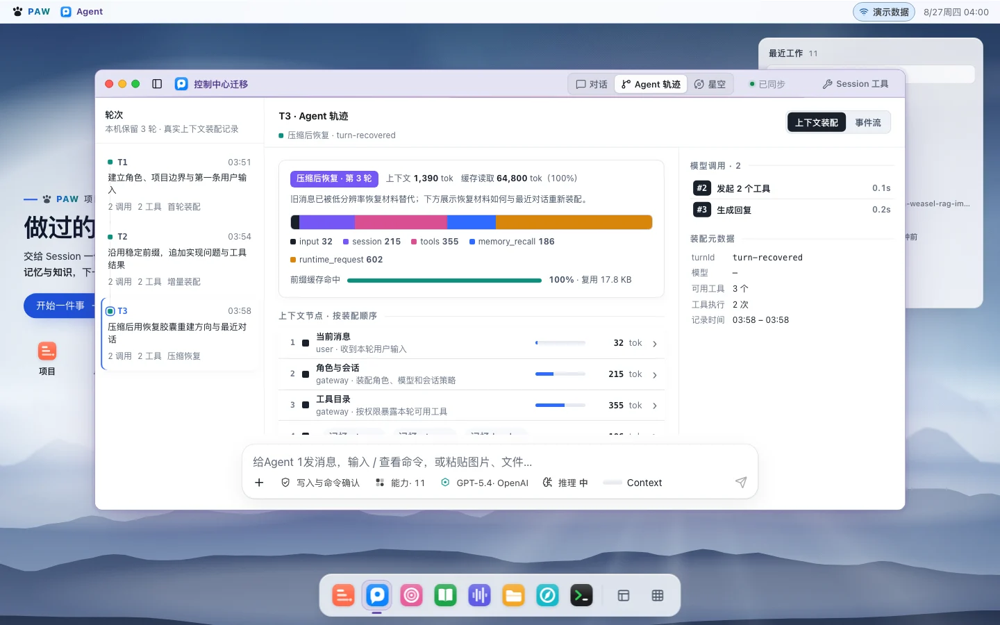
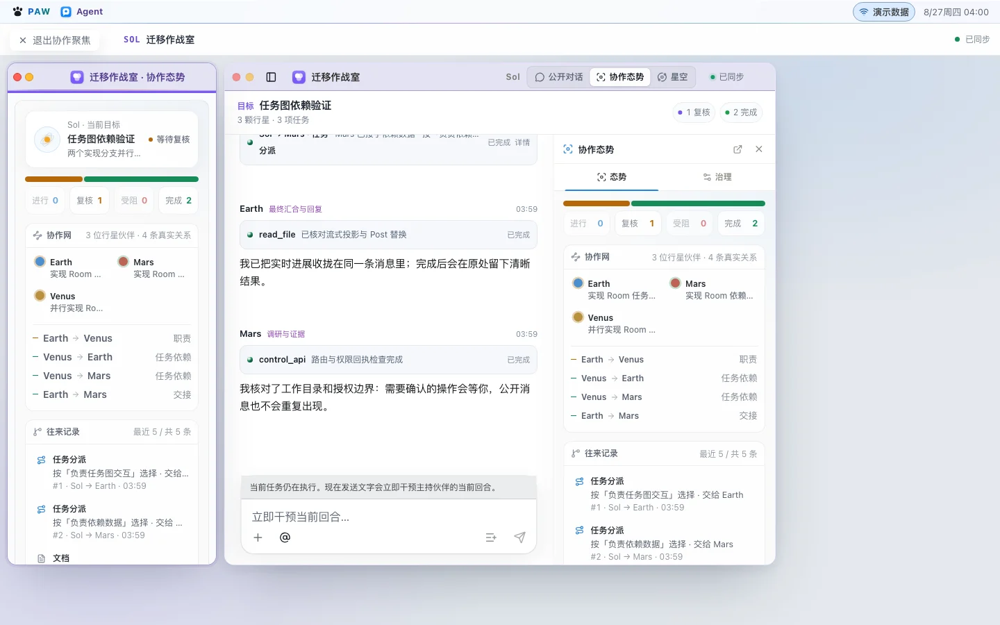

# PAW — Personal Agent Workbench

一个本地优先的 Agent 工作台：持续处理任务，按需组织多 Agent 协作，
通过测评改进执行方案，并把能力交付为可使用的应用。

**macOS 14+ · Python 3.12+ · Node.js 22.19+ · [GPL-3.0-only](LICENSE)**

[开始使用](#开始使用) · [构建与安装](release/README.md) ·
[架构](ARCHITECTURE.md) · [更新记录](CHANGELOG.md) ·
[Releases](https://github.com/7155/personal-agent-workbench/releases)

PAWOS 将对话、项目、协作、记忆、知识库和 Agent Lab 放在同一个桌面工作空间。
用户可以从一次普通对话开始，在需要时打开工具结果、执行记录或协作窗口，
并在刷新或中断后继续原来的任务。

当前提供源码预览版，面向本地开发和自托管体验。macOS 桌面宿主为 Electron；
正式安装包的 Developer ID 签名、公证及完整前台验收仍在进行，详见
[发布边界](release/README.md#source-publication-and-binary-release)。

## 核心能力

### 持续工作的 Agent

每个 Agent 使用独立、可恢复的 Pi Session，保留对话和执行上下文。
选择 Provider、模型和推理强度后，可以围绕绑定的项目读写文件、调用工具、
维护任务进度，并在执行中补充指令或停止任务。

对话中展示回答、公开思考摘要、工具进度与结果。调用证据和上下文用量按需展开；
网络中断后恢复原调用，失败时提供重试入口。



### 按需组织多 Agent 协作

简单任务由一个 Session 完成。需要分工时，主 Agent 可以调用私有 Tool Agent，
或在 Room 中组织有明确职责的 Partner Session。

Room 保持主对话稳定，由 Facilitator 分配工作、接收结果并汇总。
协作视图展示参与者、任务与交接关系；需要深入查看时，可以打开参与者窗口。
各 Session 的模型和工具执行仍由 Pi 管理。



### 测评与优化

Agent Lab 围绕具体任务建立项目：导入业务材料，整理案例和预期结果，运行基线，
检查失败原因，再比较模型、提示词、工具、Skill 和工作流程的候选方案。

实验保留案例结果、执行轨迹、用量及成本估算，让改动能够追溯和比较。
质量判定与成本、耗时分别展示；开发集上的改进和独立验证结果也分别记录。
通用优化流程仍在完善，当前能力与验收进度见 [O6](OUTCOMES.md)。

### 记忆与知识库

- **Memory** 保存个人偏好、长期事实和项目决策，支持来源检查、整理草稿、版本、归档和回滚。
- **Knowledge** 管理外部文档的导入、解析、分块、索引、检索与引用，可选接入本地 MinerU。
- Agent 按任务需要读取相关内容；记忆和文档库保留各自的数据与检索边界。

### 工具、Skill 与插件

Tools 提供可执行能力，Skills 提供按任务加载的方法，Pi Packages 承载可复用扩展。
PAW 提供发现、安装、更新和回滚入口。

垂直应用以 Extension App 插件交付。Lab 可以生成、预览、版本化和导出应用，
共享 Agent 的模型选择、执行反馈和错误恢复组件。导出应用可按配置连接本机 PAW，
或使用独立 Provider；具体业务应用由插件自身维护。

### PAWOS 工作空间

窗口、Dock、Launchpad、项目导航和协作视图帮助用户在同一任务中切换资料、结果与工具。
可选的浏览器、桌面、语音和 Squirrel/Rime 输入适配器连接到已有 Runtime。
启用输入适配器时，拼音解析、原生候选和用户词库仍由 Rime 管理；被动输入预测保持本地运行。

> 上方图片来自可复现的公开演示数据，用于展示交互界面。
> 它们不代表真实用户数据、实时模型执行或 macOS 前台验收。
> [演示生成与说明](control-center-web/docs/pawos/PAWOS_SHOWCASE.md)

## 开始使用

### 查看前端

需要 Git、Python 3.12+、uv、Node.js 22.19+ 和 pnpm 11.9.0。
在已获得仓库访问权限的环境中运行：

```bash
git clone https://github.com/7155/personal-agent-workbench.git
cd personal-agent-workbench
uv sync --locked
corepack enable
corepack prepare pnpm@11.9.0 --activate
pnpm --dir control-center-web install --frozen-lockfile
pnpm --dir control-center-web dev
```

开发服务器会显示访问地址。默认预览使用演示传输，可以查看界面；
真实 Agent 调用需要下面的 Gateway 和匹配的 managed Pi Runtime。

### 运行本地服务

```bash
uv run --locked python -m rag_ime.cli init-db

# 构建连接真实 Gateway 的前端。
RAG_IME_CONTROL_TRANSPORT=http \
RAG_IME_CONTROL_BUILD_CHANNEL=production \
  scripts/build_control_center_web.sh

uv run --locked python -m rag_ime.cli agent-gateway \
  --host 127.0.0.1 --port 8768 \
  --web-dist control-center-web/dist
```

随后访问 `http://127.0.0.1:8768`。Agent 执行需要安装与
[Runtime 合约](integrations/pi/session-runtime-host-contract.json)兼容的 Pi，
并在设置中配置 Provider 的 API Key 或受支持的 OAuth 登录。
安装顺序、Pi 源码要求和 macOS 桌面构建见 [构建与安装](release/README.md)。

已有安装应使用整套安装脚本更新组件，避免前后端和 Runtime 版本不同步。
数据库、认证信息、模型权重和插件业务资料由用户本地管理。

## 架构与职责

| 层 | 负责的事情 | 主要入口 |
| --- | --- | --- |
| PAWOS / Control Center | 对话、窗口、项目、设置与执行状态展示 | [control-center-web](control-center-web/) |
| PAW Gateway / 应用服务 | 产品 API、持久化事件、Room 协作及能力配置 | [rag_ime](rag_ime/) |
| Pi Runtime | Session、模型和工具循环、上下文、压缩、中止与恢复 | [integrations/pi](integrations/pi/) |
| Memory / Knowledge | 本地记忆治理、文档处理、索引和检索 | [架构说明](ARCHITECTURE.md) |
| 平台适配器 | Electron、浏览器、桌面、语音及可选输入集成 | [integrations](integrations/) · [macos](macos/) · [squirrel-patches](squirrel-patches/) |

PAW 的界面读取拥有该状态的服务。Room 组合普通 Pi Sessions；
Skill 只提供方法，文档只保存约定，都不接管 Session 的运行与完成状态。

## 开发与验证

从 [AGENTS.md](AGENTS.md) 进入项目，再读取 [PROJECT.md](PROJECT.md) 和
[当前 Outcome](OUTCOMES.md)。[CONTEXT.md](CONTEXT.md) 解释术语，
[DECISIONS.md](DECISIONS.md) 记录跨模块决策。

```bash
uv run --locked python scripts/check_project_harness.py
uv run --locked python scripts/check_import_boundaries.py
uv run --locked python scripts/check_route_ownership.py
uv run --locked python -m unittest discover -s tests
pnpm --dir control-center-web typecheck
pnpm --dir control-center-web test
pnpm --dir control-center-web build
```

[CONTRIBUTING.md](CONTRIBUTING.md) 包含完整检查要求。
输入、语音和桌面行为还需在真实前台应用中验证。

| 文档或目录 | 用途 |
| --- | --- |
| [release](release/README.md) | 依赖、构建、安装、升级、回滚及发布 |
| [本地运维](release/operations.md) | 对话导入、旧记忆迁移及多设备 Gateway |
| [control-center-web/CLOUD_MODEL.md](control-center-web/CLOUD_MODEL.md) | 前端源码与继续开发入口 |
| [eval](eval/) | 测评案例、实验方法和结果记录 |
| [tests](tests/) · [scripts](scripts/) | 回归检查、构建与维护工具 |
| [SECURITY.md](SECURITY.md) | 漏洞报告与敏感数据处理 |

## 许可与致谢

项目自有源码采用 [GPL-3.0-only](LICENSE)，Copyright © 2026 7155。
第三方组件、模型和服务保留各自许可，详见
[THIRD_PARTY_NOTICES.md](THIRD_PARTY_NOTICES.md)。

感谢 Pi、Electron、React、Squirrel/librime 及相关开源项目。
Tutti、Wisdom-Weasel、Yuxi、VCPToolBox 等项目为界面或工作流研究提供了参考；
具体来源与许可边界以第三方声明为准。
