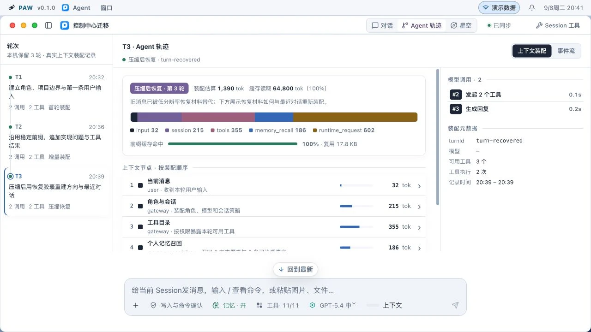
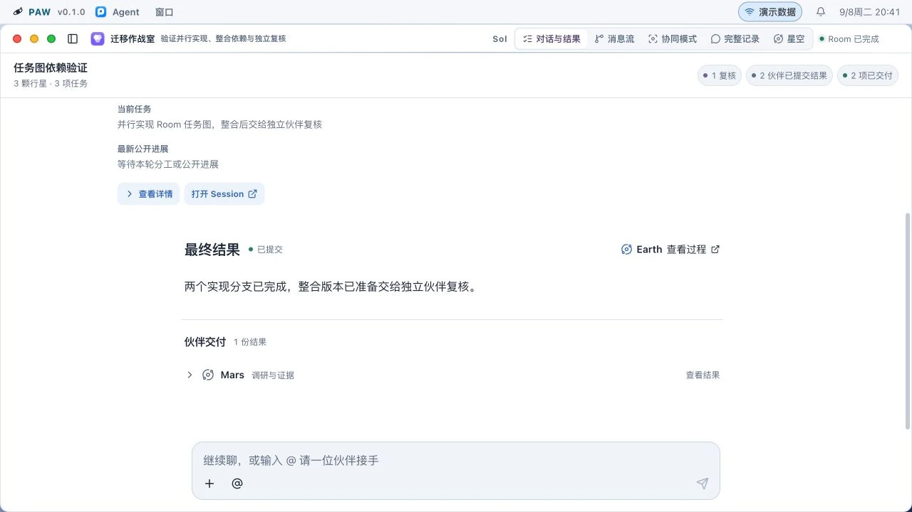
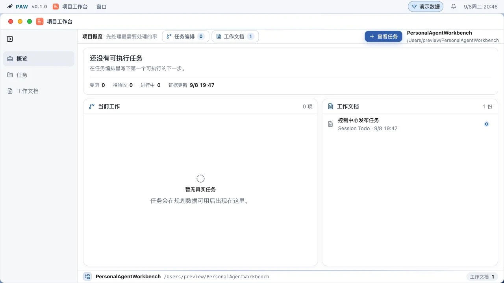
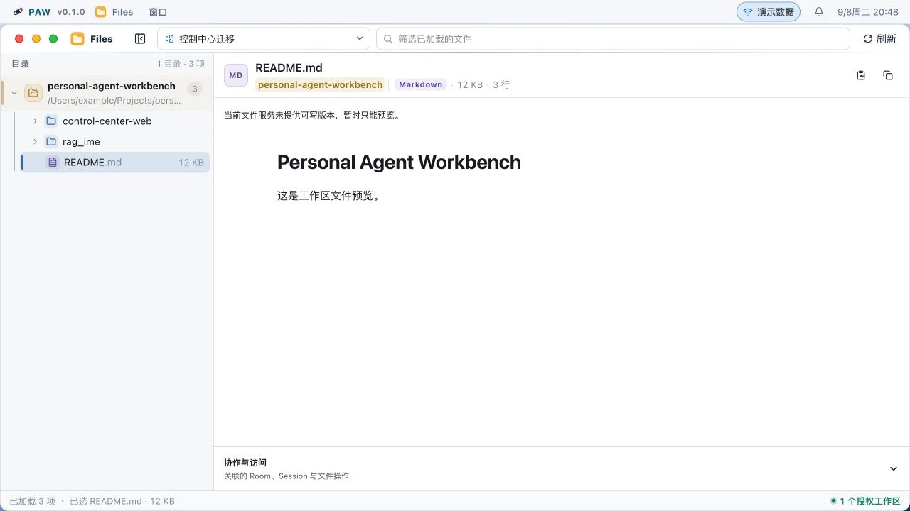
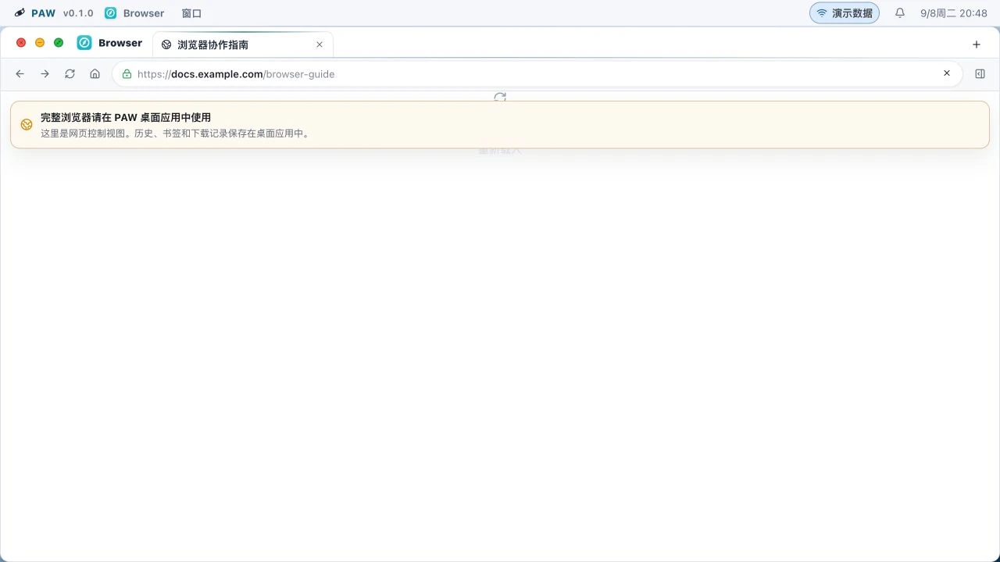
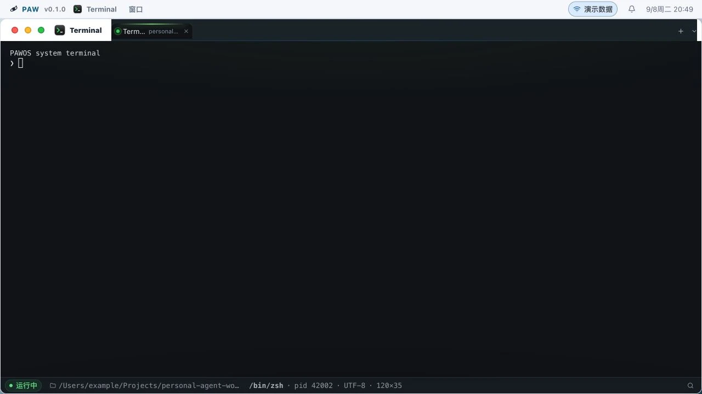
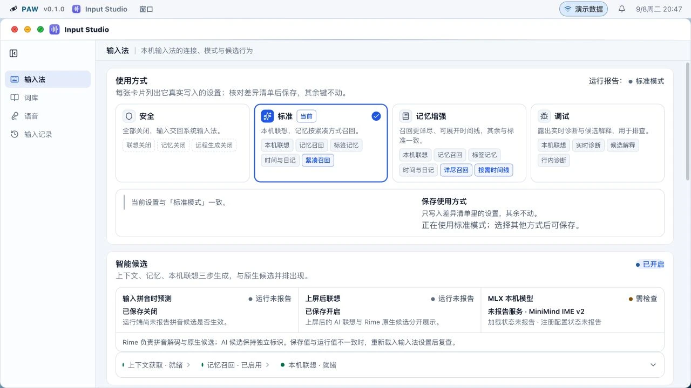
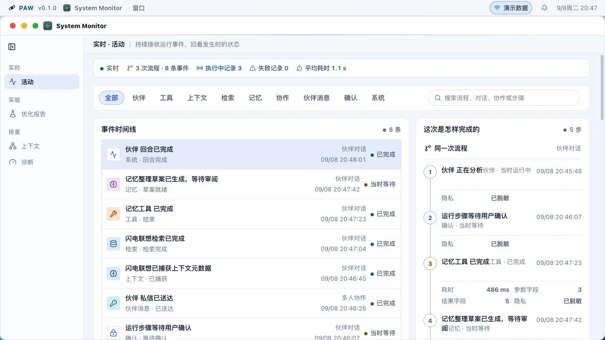
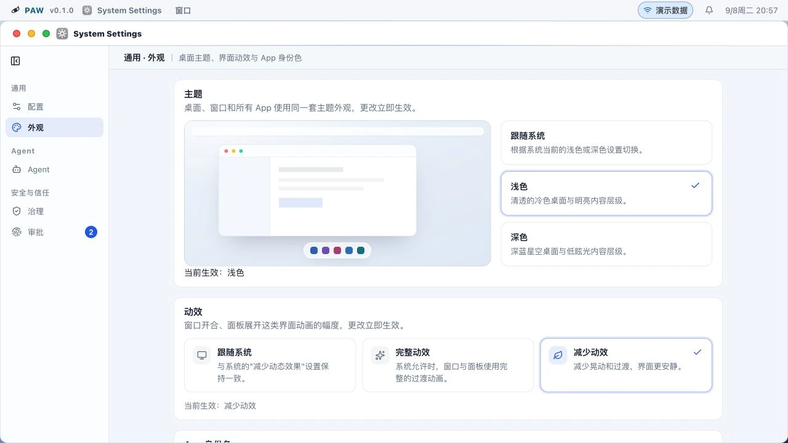

# PAWOS 功能图集

本图集对应 2026-09-08 的本地源码预览，涵盖 13 个 App、桌面、Room 协作与 Agent 轨迹。
所有界面均使用公开演示数据。没有访问个人 Session、数据库或凭据，也没有发起真实模型请求。
截图只说明当前界面与导航，不作为性能、安装或 macOS 前台验收证明。

[返回项目首页](../../../README.md) · [截图与源码指纹](manifest.json)

## 查看相同界面

在仓库根目录启动前端：

```bash
pnpm --dir control-center-web dev
```

使用开发服务器输出的地址，加上 `/?frontend=paw-os&controlTransport=mock`。
在 System Settings 的外观页选择浅色和减少动效。截图使用浏览器默认的 1280×720 视口，
除桌面外，App 窗口均已最大化。具体路由和操作见下表及各图说明。
截图使用采集时的浏览器时钟，因此重新打开时，示例时间与像素哈希可能不同。

网页预览不会提供完整的原生浏览器画面；Browser 图展示这个宿主限制。
Lab 图来自“已有实验”的比较页，Trace 图来自“新建任务”的输入页。
新 Lab 项目目录和 Trace 最近任务列表尚未在演示传输中提供完整数据，
需要真实 Gateway 才能核对这些数据流。

| 功能 | 主要用途 |
| --- | --- |
| [PAWOS 桌面](#pawos-desktop) | 从桌面 App、最近项目和 Dock 进入工作空间。 |
| [Agent 对话](#pawos-agent) | 在持续对话中阅读回答、代码与文件，保留执行和恢复入口。 |
| [Agent 上下文轨迹](#pawos-agent-trace) | 按轮次检查上下文装配、工具、记忆与模型调用。 |
| [Room 结果](#pawos-room-results) | 查看主任务的最终结果和伙伴交付。 |
| [Room 多 Agent 协作](#pawos-room-collaboration) | 同时查看主对话与参与者的公开工作窗口。 |
| [Agent Lab 实验比较](#pawos-lab) | 比较基线与候选的质量指标、变量变化和证据范围。 |
| [Trace Agent 诊断输入](#pawos-trace-agent) | 选择诊断范围与优化方向，核对原始对话和行动。 |
| [Memory 记忆与来源](#pawos-memory) | 阅读已整理事实，并追溯来源与 Session 使用记录。 |
| [Knowledge 检索与引用](#pawos-knowledge) | 搜索独立文档库，查看引用段落和原文位置。 |
| [App Center 包管理](#pawos-app-center) | 管理 Package 安装、启用状态与版本恢复。 |
| [项目工作台](#pawos-project) | 集中查看项目任务、文档与下一步工作。 |
| [Files 文件预览](#pawos-files) | 浏览授权工作区，阅读选中文件及其关联信息。 |
| [Browser 网页控制视图](#pawos-browser) | 查看标签页与地址栏；完整浏览器需 Electron 桌面宿主。 |
| [Terminal 内置终端](#pawos-terminal) | 管理与工作目录关联的终端；图中为预览终端。 |
| [Input Studio 输入设置](#pawos-input) | 查看输入模式、本地候选链路及词库与语音入口。 |
| [System Monitor 运行记录](#pawos-monitor) | 按事件时间线检查执行状态、耗时与 Trace 关联。 |
| [System Settings 外观](#pawos-settings) | 选择外观与动效，并进入模型、Agent 和治理设置。 |

<a id="pawos-desktop"></a>

## PAWOS 桌面

从桌面 App、最近项目和 Dock 进入工作空间。

预览路由：`#/appearance`。关闭窗口，查看桌面 App 与最近项目。


<a id="pawos-agent"></a>

## Agent 对话

在持续对话中阅读回答、代码与文件，保留执行和恢复入口。

预览路由：`#/agent?session=session-preview`。最大化窗口，跳到第一轮对话。


<a id="pawos-agent-trace"></a>

## Agent 上下文轨迹

按轮次检查上下文装配、工具、记忆与模型调用。

预览路由：`#/agent?session=session-preview`。Agent 轨迹 → 上下文装配。



<a id="pawos-room-results"></a>

## Room 结果

查看主任务的最终结果和伙伴交付。

预览路由：`#/rooms?room=room-preview`。对话与结果。



<a id="pawos-room-collaboration"></a>

## Room 多 Agent 协作

同时查看主对话与参与者的公开工作窗口。

预览路由：`#/rooms?room=room-preview`。协同模式，等待 Earth、Mars 伙伴窗口加载。


<a id="pawos-lab"></a>

## Agent Lab 实验比较

比较基线与候选的质量指标、变量变化和证据范围。

预览路由：`#/eval-lab`。已有实验 → 企业知识库问答 → 检查结果。


<a id="pawos-trace-agent"></a>

## Trace Agent 诊断输入

选择诊断范围与优化方向，核对原始对话和行动。

预览路由：`#/trace-agent?view=new`。新建任务，查看选择对象与原始证据；不启动执行。


<a id="pawos-memory"></a>

## Memory 记忆与来源

阅读已整理事实，并追溯来源与 Session 使用记录。

预览路由：`#/memory?layer=atoms`。选择输入段封口规则，查看正文和关联来源。


<a id="pawos-knowledge"></a>

## Knowledge 检索与引用

搜索独立文档库，查看引用段落和原文位置。

预览路由：`#/knowledge`。搜索“伙伴工具边界”，查看结果与来源位置。


<a id="pawos-app-center"></a>

## App Center 包管理

管理 Package 安装、启用状态与版本恢复。

预览路由：`#/plugins`。已安装，查看 Package 状态和版本入口。


<a id="pawos-project"></a>

## 项目工作台

集中查看项目任务、文档与下一步工作。

预览路由：`#/overview`。查看项目概览、工作文档和任务入口。



<a id="pawos-files"></a>

## Files 文件预览

浏览授权工作区，阅读选中文件及其关联信息。

预览路由：`#/files`。选择控制中心迁移 Session，打开 README.md。



<a id="pawos-browser"></a>

## Browser 网页控制视图

查看标签页与地址栏；完整浏览器需 Electron 桌面宿主。

预览路由：`#/browser`。查看标签栏与桌面宿主能力说明。



<a id="pawos-terminal"></a>

## Terminal 内置终端

管理与工作目录关联的终端；图中为预览终端。

预览路由：`#/terminal`。查看预览终端与工作目录。



<a id="pawos-input"></a>

## Input Studio 输入设置

查看输入模式、本地候选链路及词库与语音入口。

预览路由：`#/input`。查看输入方式、候选和本地运行状态。



<a id="pawos-monitor"></a>

## System Monitor 运行记录

按事件时间线检查执行状态、耗时与 Trace 关联。

预览路由：`#/observability`。查看事件时间线与 Trace。



<a id="pawos-settings"></a>

## System Settings 外观

选择外观与动效，并进入模型、Agent 和治理设置。

预览路由：`#/appearance`。最大化窗口，查看浅色主题与减少动效选项。


