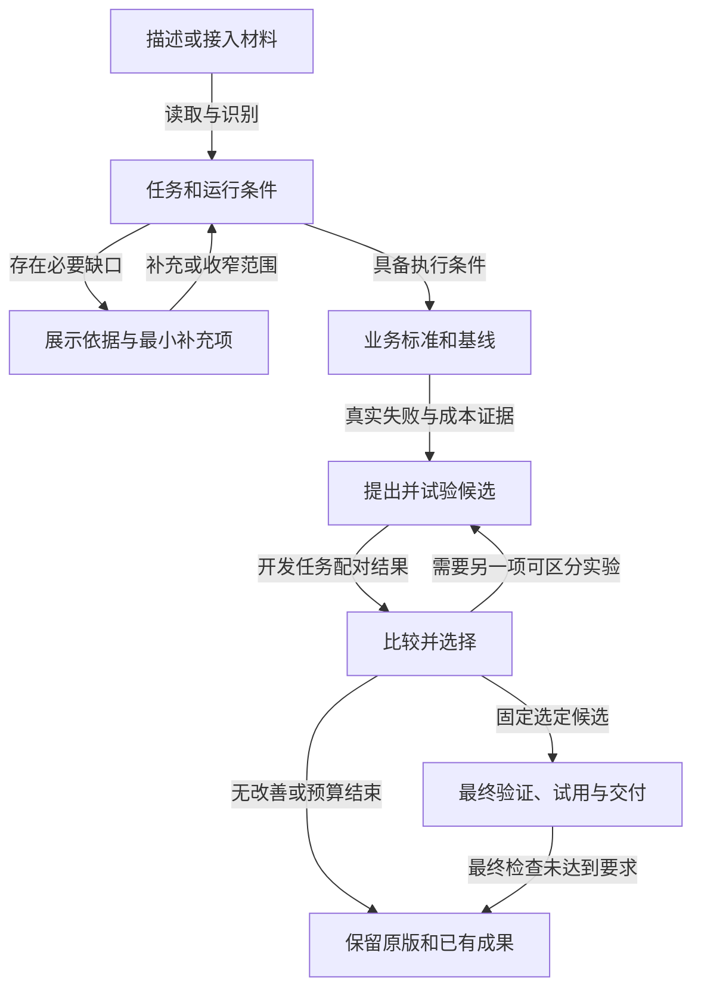
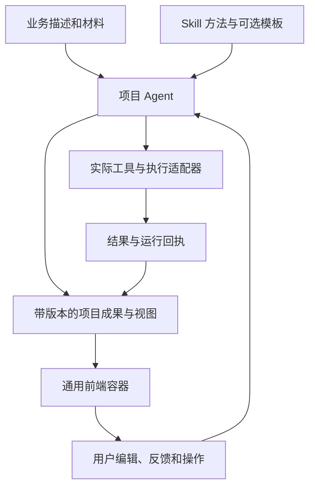
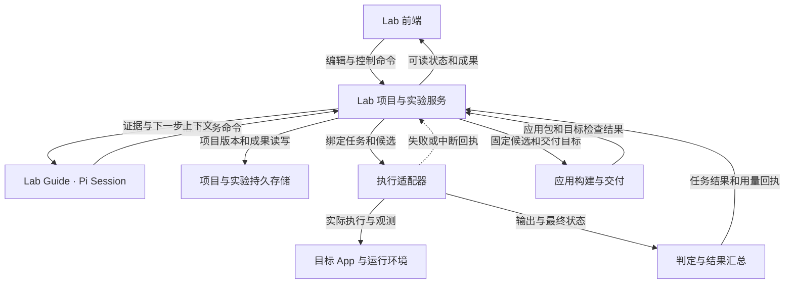

# Agent Lab 产品整体设计 v1

更新：2026-09-06。当前阶段：按 Agent 主导的通用 SaaS 修正设计并实施；本文件不是安装回执。

这是 Lab 定位、需求解释、核心能力、信息架构和交付设计的主入口。用户原话及后续选择保存在 [UR-292–UR-297](requirements/PAWOS_REQUIREMENTS_292_297.md)，已有优化要求保存在 [UR-284–UR-291](requirements/PAWOS_REQUIREMENTS_284_291.md)。[Golden 实施记录](LAB_GOLDEN_WORKFLOW_20260905.md)保留原合同和历史证据。

## 1. 已确定的定位

**Agent Lab 为开发者和小团队提供垂直 Agent 的优化与应用交付工作台。用户描述业务目标或接入项目/材料，由 Lab 带领完成理解、评测、改进和验证，交付 PAW App，并支持导出独立运行的应用。**

**控制性修正（LP-S14）：Lab 是 Agent 主导的通用 SaaS。不同项目的业务对象、结果结构与展示形式可以完全不同。Skill 提供可选的成果/交互模板，Agent 按项目选择、填充和调整；前端承载这些项目成果，不要求所有项目填同一套目标表单、经过固定页面或采用同一种评测结构。**

| 事项 | 当前决定 | 来源 |
| --- | --- | --- |
| 首批用户 | 有业务需求或现有 Agent 的开发者、小团队 | LP-S08，用户明确选择 |
| 主要交付终点 | PAW App，并可导出独立运行的应用 | LP-S09，用户明确选择 |
| 用户起点 | 一段描述、项目路径或业务材料；不要求已有成品 Agent | LP-S02 |
| 产品核心 | 可执行、可验证、能改进的专业方法；Skill 是主要载体 | LP-S04，结合 UR-287 |
| 前端范围 | 围绕完整产品重新设计，承载复杂工作 | LP-S05 |
| 当前工作 | 先完成整体设计、定位、需求和后续细节 | LP-S07 |
| 项目界面来源 | Agent 按项目生成成果与展示，Skill 提供模板；平台保持通用 | LP-S14，修正此前固定业务工作台方案 |

用户通常在三种时刻进入：已有 Agent 表现不稳定或成本不合适；有业务资料但尚未形成可用应用；模型、工具或业务规则变化后，需要决定是否采用新版本。共同要完成的工作是：**知道当前问题在哪里，找到有依据的改法，并拿到可以使用的成果。**

首版按开发者和小团队设计，保留自然语言引导、可读的业务判断和必要的工程细节。独立云端托管、多人实时共编、第三方平台格式转换与商业计费不是这次已选的首版交付终点；将来可以围绕同一项目和运行合同扩展。

## 2. 产品承诺与支持范围

Lab 承诺完成一轮有证据的工作：识别材料与执行能力，建立业务标准和合理基线，提出并实施候选，比较结果，交付选定版本或说明保留原版的理由。是否改善、改善多少、能推广到哪些任务，由实际证据决定。

| 输入情况 | 开始方式 | 可形成的成果 |
| --- | --- | --- |
| 业务描述 + 文档/数据 | 识别输入输出，补足必要业务判断，建立合理初版 | 初版应用、评测标准；后续版本才形成优化对照 |
| 可访问的项目目录 | 识别入口、模型、工具、Skill、数据与测试，保存基线 | 对真实项目的候选改动、验证和应用交付 |
| 外部 API 或工作流 | 明确可调用、可观测、可配置和可交付的范围 | 在支持范围内运行对照或生成接入方案 |
| 只有日志或失败描述 | 分析已知材料，定位还缺的执行或验收条件 | 有依据的诊断、材料缺口和下一步；可重放后再比较 |

知识问答、检索、业务操作、运维和代码任务可以共用实验与版本机制，但工具、运行环境和成功判定不同。每个项目显示“能读取、能执行、能修改、能交付”的实际能力，具体适配器的支持范围需要逐项验收。

公共数据集按普通材料导入，或作为可选案例/回归包；产品入口不绑定数据集名称和固定题库。模型、Prompt、Skill、工具/检索和工作流均可成为优化对象，但不要求一轮全部修改。

## 3. 用户旅程与阶段成果

下面四组工作说明常见优化方法，不是所有项目必须出现的四个前端页面。Agent 根据项目决定当前任务、需要的成果与交互，可以回看、修正和继续。Lab 尽可能通过读取和执行补齐可检查的事实，只将业务含义、必要外部信息和范围选择交给用户。

| 阶段 | Lab 主动完成 | 用户的主要参与 | 阶段成果 |
| --- | --- | --- | --- |
| 理解任务 | 检查材料、识别实现与环境、建议可行路径和初版 | 纠正业务目标，补必要材料，明确交付用途 | 可编辑场景说明、接入能力、运行绑定、基线计划 |
| 约定成功标准 | 起草任务与规则、复用测试、准备判定与必要校准，跑通首条任务 | 判断哪些结果可用，纠正关键规则 | 任务与标准版本、可运行基线、初次结果 |
| 实验改进 | 读失败证据、提出实验、实施候选、运行和比较，按预算收束 | 修正假设或约束，选择继续方向 | 失败解释、实际差异、候选版本、可比较结果 |
| 试用与交付 | 固定选定版本、生成目标应用、检查运行、整理接入与回退 | 试用成果，选择版本和交付范围 | PAW App、独立应用、验证报告和接入说明 |

下面的流程回答“材料不齐或没有改善时，用户怎样继续”：

流程允许以可使用版本、保留原版或清楚的材料缺口结束，不会为了展示收益无限生成候选。最终验收只在候选固定后进行；查看结果后继续调优时，记录该验收集已使用，不能再将其声称为全新的独立验证。

### 首次使用

首页提供描述输入、选择目录/添加材料和最近项目。创建后先返回实际识别的场景说明，显示来源和当前缺口；材料足够时，Lab 连续推进到首条可验证任务。运行所需的模型、范围与预算使用明确的项目设置或现有授权，不逐次重复询问。

只有描述时，Lab 先帮助形成可运行初版，不编造已经读取的文件或业务数据。有现成项目时，先保存当前版本和实际运行方式。入口文本、路径存在、项目可启动、任务可验证是不同事实，分别展示。

## 4. 核心对象与关系

这些是可能出现的产品语义，不是一套要求所有项目填满的固定数据库字段。平台统一保存项目身份、用户描述、材料、带版本的成果、执行绑定与运行回执；目标、标准、候选、解释或交付说明可以是 Skill 模板产生的不同成果。持久身份和版本由服务保存，聊天与前端共同引用。

| 对象 | 含义与关系 |
| --- | --- |
| Lab 优化项目 | 围绕一个业务目标持续工作的空间，可绑定 PAW 项目、目录或外部执行入口；生命周期长于一次 Session |
| 目标版本 | 输入输出、业务质量要求、成本目标、可改范围、预算和交付目标；修改后明确影响哪些结果 |
| 材料与环境绑定 | 实际来源、读取范围、运行位置、启动/重置方式与可用能力；不把路径字符串当作已连接 |
| 任务与标准版本 | 有来源的任务、判定规则、任务划分与校准依据；同一轮比较固定 |
| 方法版本 | 分别记录 Lab 的优化方法与业务 App 的 Skill；声明适用范围和实际加载版本 |
| 应用候选版本 | 基于某个父版本的模型、Prompt、Skill、工具、工作流和代码改动；可查看真实差异 |
| 实验与任务运行 | 实验固定目标、标准、候选与环境；一次任务运行记录实际执行、结果、失败和用量 |
| 解释与选择 | 把观察、待验证假设、比较结论和选择理由关联到具体证据；可纠正，不创造执行状态 |
| 交付版本 | 引用选定候选、目标格式、应用包/源码及目标环境检查；与实验记录保持同一来源 |

Lab 优化项目不等于 PAW 的长期 Project、一个仓库目录或一次 Pi Session。实验也不等于一次模型调用；多个检查项不等于多个独立业务任务。

## 5. Skill 与专业方法设计

### 两类方法，分别验证

**Lab 方法**负责理解场景、设计验收、辨认失败、提出实验、实施改动和判断交付。**业务 App 方法**负责具体任务的操作顺序、领域约束、证据检查和例外处理。前者的评测内部信息不进入后者的业务运行。

首版按四组能力组织方法，每组可以由主 Agent 按需加载相关 Skill/参考资料，不要求四个常驻 Agent，也不将 Skill 变成第二套执行循环：

| 方法能力 | 需要读到的输入 | 必须产生的成果 | 用户可干预处 |
| --- | --- | --- | --- |
| 理解与建立标准 | 业务描述、实际材料、已有实现、正确/错误案例 | 场景说明、可验收规则、运行能力和缺口 | 纠正业务含义与可接受结果 |
| 诊断与设计实验 | 真实任务结果、必要 Trace、代码与判定解释 | 已观察事实、待验证解释、最小候选和对照条件 | 纠正归因、限制不能改的规则 |
| 实施候选 | 已选择假设、允许范围、当前版本、目标兼容性 | 实际配置/Skill/代码差异、基本检查和可运行候选 | 编辑差异、选择另一个方向 |
| 验证与交付判断 | 固定标准、配对结果、退化项、用量、目标环境检查 | 采用/保留/继续验证的依据与同源交付版本 | 试用、选择版本和交付用途 |

每份方法应说明触发条件、输入、可用工具、实际操作、完成条件、输出形状及失败处理。成果至少能表达 `观察 → 解释 → 建议实验 → 引用证据`；“可能根因”保留为假设，不能直接升级为已经证明的因果。

Skill 的关键价值是决定下一次值得做的实验。例如缺知识、查询过滤错误、上下文丢失、阅读遗漏、工具超时分别指向不同改动。需要诊断上界时可以做专门探针，但使用额外参考信息的诊断不能冒充正常执行成绩。

### 方法版本进入产品工作区

用户可查看当前业务方法、实际加载版本、适用范围、关联失败、编辑差异及采用记录。修改方法形成新候选；旧实验继续指向旧版本。Lab 方法也保留自己的版本与验证记录，避免业务收益来自 Lab 方法变化却被归因到业务 Skill。

优先维护少量有任务证据的方法。方法可通过共同的操作接口调用读取轨迹、修改候选、运行实验、读取结果和打包能力；前端点击与对话请求走相同的业务命令。

## 6. 两层评测与优化合同

### 业务 App 的评测

1. 固定可比的任务、标准、初始环境和原版；合理的简单方案也可作为基线，不故意劣化原方案。
2. 优先用测试、结构和业务最终状态检查可客观判断的部分；开放式回答使用与业务判断校准的判定。检查项与业务任务数分别统计。
3. 调优、候选选择和最终验收使用范围明确的数据。参与选方案的数据不再当作全新验收证据；材料少时保留探索结论及范围说明。
4. 候选绑定实际改变的对象。单因素实验用于辨别原因；组合版本可以整体比较，但不把总收益归给某一个 Skill 或工具。
5. 先满足关键质量要求，再比较成本，同时展示受影响任务类别和退化项。耗时默认用于诊断，是否成为目标由业务决定。
6. 分开业务运行、评审、优化搜索和交付检查的开销。失败尝试保留已发生用量；未知用量显示未知，估算不称为账单，字符数不冒充 token。
7. 结束可以是采用、保留原版、继续验证、预算结束、用户停止或材料/环境缺口；只有真实结果支持时才显示改善。

Agent 说“已完成”与业务环境中实际完成需要区分，评测按任务检查真实输出或最终状态。[Anthropic 的 Agent 评测说明](https://www.anthropic.com/engineering/demystifying-evals-for-ai-agents)支持这一结果与轨迹的区分。

### Lab 自己的专业能力评测

用相同基础模型、项目材料、工具、权限和优化预算，对照合理的通用优化指令与加入 Lab 方法的版本。比较最终候选在未参与调优任务上的表现、关键退化、实际可应用性、总优化成本及证据不足时是否正确保留原版。

Lab 方法有效性与业务 App Skill 有效性分别报告。一次诊断说得有道理、一次改题成功或模型自评更高，都不足以证明 Lab 更会优化。方法没有增益时允许删减；能力范围随实际验证扩展。

## 7. Agent 主导的通用前端

### 平台容器与项目内容分别负责什么

用户在 LP-S14 明确否定了把所有项目放进同一套目标字段和业务页面。平台提供稳定、可恢复的工作容器，具体项目工作面由 Agent 的成果决定。

| 平台统一能力 | 项目决定的内容 |
| --- | --- |
| 项目身份、访问边界、最近项目 | 业务对象、术语、要解决的问题 |
| Agent 对话与当前上下文、转向和停止 | 当前计划、下一步、需要的用户输入 |
| 文件/材料、成果列表、版本与引用 | 成果数量、结构、标题、页面组织 |
| 文档、结构数据、代码与隔离交互页面的承载 | 表单字段、表格列、图表、业务预览或定制交互 |
| 真实运行与回执、输入提交和错误恢复 | 运行对象、判定办法、成功含义与交付形式 |

项目首页从描述、材料/连接和已有项目开始，不先让用户填写统一的业务目标模型。进入后保留对话、当前成果及可达的资源/运行入口。导航由项目实际成果与 Agent 建议组织；“标准”“实验”“方法”“交付”等只是某些项目会出现的名称，不是所有项目都预置的八个空页面。

### Skill 模板如何形成项目界面

Skill 提供方法以及可选的成果模板，例如 Markdown 结构、可编辑数据结构、交互页骨架或某个工具结果的视图。Agent 按当前项目选用模板、填充真实数据、修改结构或生成更合适的成果。模板是起点；平台不把一份模板提升为全部业务的字段合同。

每份成果保留身份、版本、作者/来源、模板引用和必要的材料/执行引用。Agent 可以调整内容和表现形式；旧成果与旧运行仍指向原版本。项目内编辑提交给同一成果命令；需要 Agent 继续工作时携带明确的成果版本和用户输入，不能从前端复制出第二套事实。

平台先提供通用承载器：Markdown/文档、结构化数据及表格、由成果声明的输入表单、代码/文件，以及隔离的交互 HTML 页面。图表、拓扑、业务模拟、领域专用编辑器可由模板或项目生成页面承载。它们是表现能力，不限定业务对象。复杂页面需要的真实操作通过声明的项目动作和现有工具调用，页面代码不自行取得平台凭据或声明执行成功。

### 同一个容器可以出现不同的工作形态

| 项目例子 | Agent 可能组织的成果和交互 |
| --- | --- |
| 售后知识助手 | 规则文档、问题/回答对照、证据查看、客服试用窗口 |
| 运维 Agent | 服务关系图、故障环境、事件时间线、操作与最终状态检查 |
| 代码迁移 | 文件差异、兼容矩阵、测试输出、可运行分支或源码包 |
| 有业务想法但尚无应用 | 需求对话、可操作原型、待澄清输入、初版实现与验证 |

这些是形态示例，不是内置行业枚举。新增项目不应要求修改 Lab 根组件、添加数据集分支，或把不适用的业务信息塞进通用字段。接入一种新的真实执行环境，仍需要对应工具或适配器；能渲染一个页面不代表能运行该环境。

### Agent、界面与真实状态

Agent 主导工作的推进和成果组织。前端提供直接阅读、修改、比较、试用和反馈，使用户可以在成果上操作；不要求所有操作都重新写成长段聊天。下一步按钮可以来自当前成果动作，而不是由固定四阶段状态机推算。

浏览候选、比较对象、业务试用和交付选择属于不同项目动作，不能因打开页面而暗改运行或交付版本。成果更新保留草稿与焦点，页面刷新读取服务端项目/运行身份，停止和恢复沿用 Pi 与实际执行器的权威状态。尚未发生的业务结果不填示例分数，总量未知时不编造进度。

宽屏可把对话与成果并排、对照多个成果；窄窗保留当前内容和主要操作，辅助区可收起。画布只在关系本身有助理解时使用，连线说明真实关系。前端不用预先规定每个项目必须有画布、表格、Golden 或某组固定面板。

### SaaS 接入与实现边界

产品按通用 SaaS 组织项目和成果，租户/工作空间访问边界来自服务端身份。用户粘贴的本地路径不能当作 SaaS 服务器路径读取，必须通过浏览器上传、已授权仓库连接或该用户绑定的本地/远程执行器取得材料。当前 PAW 本地宿主是一个实现环境；本地材料读取通过并不证明云端连接、多人权限或 SaaS 部署已完成。

### 已有原型的定位

[2026-09-06 工作台原型](prototypes/lab-workbench/README.md)是知识问答项目的固定示例，覆盖了若干阅读、比较与恢复交互。LP-S14 已修正其作为通用产品前端的假设：它只能作为一种项目模板的参考，不再作为所有项目共用页面、字段和导航的实现蓝本。其数据与执行仍是明确标注的模拟内容。

## 8. 状态、控制与异常路径

工作阶段、执行状态、实验结论和交付状态分别表示不同事实：

| 维度 | 建议呈现 |
| --- | --- |
| 工作阶段 | 理解任务、约定成功标准、实验改进、试用与交付 |
| 执行状态 | 未启动、准备、运行、等待必要输入、中断、停止中、已停止、失败、已结束 |
| 实验结论 | 有证据支持采用、保留原版、需更多验证、不可比较 |
| 交付状态 | 未生成、正在生成、生成失败、可导出待验证、目标环境检查通过、已应用 |

这些是产品展示建议；持久状态机和现有 API 的映射在实现合同中定义。自然语言解释不能直接写入“执行成功”或“已应用”。总任务数未知时显示当前步骤，不编造百分比。

需要具体处理的异常：目录不可访问、启动失败、依赖缺失、工具错误、评审不确定、费用不可核对、用户修改约束、连接中断、候选无改善、打包失败和目标环境行为变化。每项显示已完成成果、影响范围与一个可执行的下一步。

同一命令重试复用身份；提交结果不确定时先核对原操作。恢复复用 Pi 的语义，外部状态写入不能盲目重放。用户已有的范围和执行授权继续有效，不添加第二轮逐工具确认。

## 9. 架构与所有权

这是目标架构的职责图，不是新微服务部署图。初期可以在现有服务中保持清楚模块和独立执行适配，按需要扩展部署。

前端和 Guide 操作同一组持久对象；Pi 执行其自身的 Agent/Tool 循环，执行适配器连接真实目标，业务结果由实际判定产生。

| Owner | 职责边界 |
| --- | --- |
| Pi | Guide 和使用 Pi 的任务执行：模型/工具循环、转向、停止、上下文、会话恢复 |
| Lab 服务 | 项目范围、带版本的成果/视图、材料与执行绑定；领域结果由实际工具/适配器产生 |
| 执行适配器 | 准备/调用/观察/重置目标；说明环境和可修改范围；原有外部 App 可保留自身框架 |
| Skill | 条件化方法、可选成果与交互模板；使用工具形成项目成果，不拥有状态、权限或执行循环 |
| 前端 | 通用项目容器、动态成果与交互承载、真实运行投影；业务结构由项目成果与模板决定 |
| 构建/交付适配 | 将固定业务实现装配为目标应用，处理依赖与目标检查 |

场景方法、执行适配器与可选案例包分别演进。新增业务项目不应要求添加固定题库分支；接入新技术环境则需要真实、经过验证的适配能力。

网页中的本地路径需要通过实际目录访问、仓库连接或本地执行器接入。[MDN 的目录选择说明](https://developer.mozilla.org/en-US/docs/Web/API/Window/showDirectoryPicker)说明了用户交互与目录句柄的要求。首版优先复用 PAW 本地能力；云端接入仍沿用同一材料、运行和交付绑定。

## 10. PAW App 与独立应用的交付设计

两个目标来自同一选定候选。业务方法、工具逻辑和配置来源保持一致，宿主适配、启动入口和构建产物按目标生成。

| 内容 | PAW App | 独立运行应用 |
| --- | --- | --- |
| 业务能力 | 固定的模型配置、Prompt、Skill、工具与工作流 | 同一业务能力及必要的目标适配 |
| 用户界面 | 与业务任务匹配的 PAW App 界面 | 与业务任务匹配的独立界面；首版建议本地启动的 Web App |
| 执行依赖 | 当前 PAW/Pi App 与 Package 合同 | 明确且可安装的最小运行依赖，独立启动入口 |
| 数据与连接 | 声明的项目材料和连接 | 可携带材料或可配置外部依赖；不依赖未声明的本机私有路径 |
| 验证 | 实际装载、业务输入输出、停止/恢复和版本一致性 | 独立启动、接口、代表性任务与必要恢复验证 |
| 使用与回退 | 当前 App 生命周期中的安装、更新和上一版 | 运行说明、依赖配置、上一个可用版本 |

独立运行首先建议交付可启动源码包与业务 UI，必要时提供 HTTP/CLI 入口；具体语言与运行依赖优先复用业务实现。平台安装器、云端一键托管和外部平台节点格式可以后续分目标支持。这些包装细节是当前方案默认值，不扩大用户已选的交付承诺。

最终提供三个关联成果：**可运行应用、验证报告、运行/复现说明**。业务应用不携带隐藏验收答案、评审内部信息或默认导出的密钥。使用必要业务数据与外部服务时列出实际依赖及配置入口。

交付检查必须针对实验中选择的版本。因目标适配改变行为时，保留转换差异并重跑相关任务；未完成目标检查的包可明确标为待验证，不能显示已经可用。正常使用不因缺少可选来源信息而被额外阻断。

## 11. 首版范围与验收

### 首版必须贯通

- 从描述/材料或受支持项目目录创建一个新的优化项目。
- Lab 帮助准备业务标准和合理初版/原版，跑通真实任务。
- 对模型、Prompt、Skill、工具或工作流中的实际对象创建候选并验证；至少覆盖业务 Skill 与另一种真实改动能力。
- 前端能审核标准、编辑方法、看真实进度、诊断失败、比较版本、停止和恢复。
- 试用并交付 PAW App 与独立运行应用，报告能追到同一候选与目标检查。
- 新任务可以进入下一轮，已有标准、失败和版本保持可追溯。

首个完整验证建议选资料问答/知识支持这一类现有基础较多的任务，用新材料验证接入与交付；它是首个工程验收样本，不是固定产品入口。其他场景沿用其真实执行和判定合同，逐项公布支持范围。

### 两类验收问题

| 检查范围 | 真实路径是否运行 | 是否满足产品要求 |
| --- | --- | --- |
| 接入 | 文件/入口确实可达，能执行首条任务 | 用户不用改 Lab 核心或手写后台流程 |
| 方法与候选 | 实際加载正确 Skill，差异和版本可查 | 用户能根据失败修正方法并验证效果 |
| 实验 | 固定条件运行，回执、用量和判定真实 | 推荐有依据，退化和不确定没有被隐藏 |
| 前端 | 编辑、停止、刷新、恢复和版本切换可用 | 未参与开发的体验者能完成完整工作 |
| PAW 交付 | App 真正装载并运行 | 用户可以使用选定业务版本 |
| 独立交付 | 在声明的独立环境启动并完成任务 | 导出的应用可离开 PAW 使用，依赖明确 |

单次小样本可证明操作链路；稳定性和可推广收益需要适当规模、重复运行及未参与调优任务的证据。具体业务质量阈值、优化预算和样本量进入项目设置，当前不预填收益数字。

建议关注：接入成功率、首条真实任务完成时间、得到可信结论的比例、导出后实际可用比例、后续回归使用情况和每轮总优化成本。来源于该产品自己的体验数据后再制定数值目标。

## 12. 实施顺序与后续细节

实现已进入 I1：通用项目、带版本的动态成果、材料快照、项目 Agent 和可选执行绑定。按 LP-S15、LP-S16，最终必须由助手操控真实前端完成实验全流程和 App 导出/运行检查；源码、测试和静态展示分别记录，不单独宣告成熟产品完成。

| 工作项 | 主要责任 | 依赖 | 可验收结果 | 回退点 |
| --- | --- | --- | --- | --- |
| I1 通用项目、动态成果与首次真实执行 | Lab 容器、成果服务、Skill 模板、Pi/执行适配 | 项目/成果与动作合同 | 从新材料进入，由 Agent 组织项目特有成果并得到首条结果 | 旧实验入口和已有资料保留 |
| I2 标准与方法编辑 | Golden、方法资源、编辑工作区 | I1 | 可审阅标准、实际 Skill 版本与可运行候选 | 项目上一版本，旧快照不改 |
| I3 诊断、实验与选择 | 实验服务、方法、运行/比较工作区 | I2 | 同条件对照、真实进度、停止/恢复与选择依据 | 停止新任务，保留已完成成果 |
| I4 双目标交付 | App 构建、宿主/独立适配、预览与交付 UI | 已选候选；目标兼容性从 I1 开始 | 同一候选在 PAW 和独立环境实际可用 | 上一个可用交付版本 |
| I5 新材料全程验收 | 主 Session 整合、产品体验者 | I1–I4 | 前端从头到尾完成；检验异常与导出后的行为 | 未通过范围如实保留，不替换稳定版本 |

当前主 Session 负责整合，表中的角色不表示已经分派任务。各项工作文档、验证责任和进度延续本设计及对应源码回执；运行身份由 Runtime 提供，不写成 Markdown 运行状态。

进入实现前细化：通用项目/成果/视图合同、Skill 模板与动作接口、首个执行适配器、App 双目标构建合同，以及不同项目生成不同工作面的交互。其余实现选择在 owner 源码和测试基础上确定；发现会改变用户目标的取舍再单独讨论。

## 13. 当前实现与剩余能力

2026-09-07 的[通用工作台与双目标应用验收](LAB_GENERIC_WORKBENCH_ACCEPTANCE_20260907.md)记录当前实现和实际浏览器路径：

- 默认入口已成为通用 Lab 项目；描述、材料、项目 Guide、版本化成果和工作区布局有服务与前端配套。Golden 是可选执行绑定，不是每个项目的统一结构。
- `lab_project` 经实际项目 Guide 的 Pi Session 调用。Skill 提供可选成果/交互模板；两个新项目分别生成售后应用与服务依赖图，未要求修改 Lab 核心以适配业务字段。
- 应用源码、Skill、上下文和模型形成不可变版本，支持试用、PAW 激活/回滚与两个 ZIP 目标。最终 v11 已在 PAW App 宿主和独立 Python 服务完成实际咨询；历史、重启、回滚与窄屏应用内容分别验证。
- Golden 评审协议已升级到 v2，修正评审引用与业务回答要求混淆；新旧协议快照分离。验证题跨快照复用会显示次数与重合范围，未知判定和未知费用保留。
- 两轮正式 B0/C1 比较均不能确认改善。C2 针对实际应用商品范围失败修整，并通过两个目标的检查探针；不借用 B0/C1 的分数宣称其统计收益。
- 通用项目材料当前支持本执行主机可读的有界 UTF-8 文本；仓库/云连接、更广的文档格式与真实业务动作需要各自适配器。独立运行器首版支持声明的文本生成操作，不能代表任意 Tool 或部署环境。
- 现有预算字段仍不能宣称实际账单费用硬限。多租户云部署、任意外部平台转换、原生一键导入及已安装 PAW 的完整验收仍是后续边界。

源码入口：[通用前端](../../src/features/eval-lab/projects/)、[项目服务](../../../rag_ime/agent_lab/projects.py)、[项目应用层](../../../rag_ime/agent_lab/project_application.py)、[应用版本与调用](../../../rag_ime/agent_lab/apps.py)、[独立运行器](../../../rag_ime/agent_lab/app_runtime.py)、[Lab Skill](../../../integrations/pi/skills/agent-lab-project/SKILL.md)。旧 [场景应用](../../src/features/eval-lab/ExperimentApplication.tsx) 和原生 [Extension App 合同](../../../integrations/pi/skills/pawos-app-builder/references/extension-app-contract.md) 保留各自范围。

## 14. 参考取舍与设计完成边界

本轮查阅官方资料，提取具体交互。以下为参考能力与 Lab 设计判断，不表示已安装这些产品、接通其 API 或验证生成质量。

| 参考产品 | 核验到的机制 | 用于 Lab 的设计 |
| --- | --- | --- |
| [Flowith Canvas](https://flowith.io/docs/en/agent-neo/canvas-navigation/) | 任务/文档节点、分支继续、网页预览及源码 ZIP 下载 | 探索不同改法，保留版本来路，从节点打开成果；验证和交付仍关联 Lab 对象 |
| [Braintrust Loop](https://www.braintrust.dev/docs/loop) 与[实验比较](https://www.braintrust.dev/docs/evaluate/compare-experiments) | 引导旁打开成果标签页；按任务对齐输出、筛选退化和查看差异 | 引导与专业工作区共享对象；汇总后下钻具体任务。Loop 文档明确其不修改应用代码或部署，不能直接推导完整 App 交付 |
| [Opik Ollie](https://www.comet.com/docs/opik/ollie) | 配合本地项目连接，从失败 Trace 读代码、修改、重跑并验证 | 让失败证据、实际改动和复跑形成连续操作。其产品自己的审批规则不自动成为 PAW 要求 |
| [LangSmith Studio](https://docs.langchain.com/langsmith/use-studio) | 图/对话视图、状态细节、历史与检查点分支 | 同一任务的简洁查看与专业诊断并存；具体恢复能力取决于 PAW/目标执行器，不能从界面类比推导 |
| [Dify 运行历史](https://docs.dify.ai/en/cloud/use-dify/debug/history-and-logs)、[应用管理](https://docs.dify.ai/en/cloud/use-dify/workspace/app-management)与[发布](https://docs.dify.ai/en/cloud/use-dify/publish/README) | 运行的结果/详情/Trace 分层，应用发布入口及 DSL 导出 | 区分业务 App、构建工作台与交付目标。DSL 的配置导出不包含实际知识库内容，不能作为独立应用已经可运行的证据 |
| [JupyterLab 工作区](https://jupyterlab.readthedocs.io/en/stable/user/interface.html) | 多文档标签、可调整分栏、聚焦单文档后恢复布局 | 为熟练用户保留阅读与比较空间；保存界面布局与核对执行状态分别处理 |

Flowith 也提供官方 [Canvas Cowork Skill](https://flowith.io/blog/canvas-cowork-skill/)，用于让 coding Agent 经浏览器桥接操作画布。这使其成为设计探索的可选工具。本轮使用其公开交互资料作为参考；未安装该 Skill、连接账户、上传本项目材料或调用其生成服务，实际设计质量和接入稳定性尚未验收。网页生成和源码下载能力本身不证明可以完成 PAW 的执行集成、同条件评测与独立 App 交付。

其他方法参考保留：[Stitch](https://blog.google/innovation-and-ai/models-and-research/google-labs/stitch-updates/)用于描述/材料起步和迭代成果的类比；[GEPA Agent Skill](https://gepa-ai.github.io/gepa/guides/agent-skill/)是后续可替换搜索方法的研究入口。附件中的 SkillsBench 数字、第三方脚本与平台能力不写成 PAW 实测效果。

本设计确定定位、需求、核心对象、方法与交互边界。后续源码实现、真实实验和两个应用目标的运行证据集中在[当前验收记录](LAB_GENERIC_WORKBENCH_ACCEPTANCE_20260907.md)，与本节的外部产品类比和旧交互原型分开。原生安装及云端部署仍不由这些设计或源码浏览器结果推导。

## 本轮持续打磨与验收安排

LP-S16 要求技能、工具、环境、提示词及前后端配套一起打磨，持续到 **2026-09-07 07:00（Asia/Shanghai）**。这不改变 Agent 主导与 Skill 可选模板的产品方向。验收应保存新项目在真实前端的操作路径、实际任务/实验回执、成果版本、选定应用、导出产物和独立运行证据；错误、停止、刷新恢复与版本冲突也需要验证。

当前已从真实前端完成两个新项目、两轮正式对照、C2 修整及双目标 App 运行与导出。最后回归、恢复检查与仍未覆盖的生产边界见[验收记录](LAB_GENERIC_WORKBENCH_ACCEPTANCE_20260907.md)；不把旧原型的模拟结果归入本轮实测。
